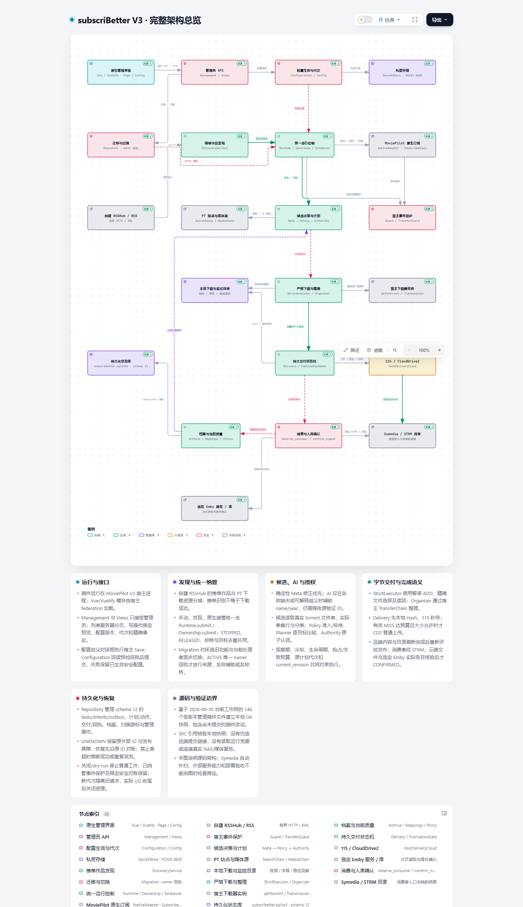
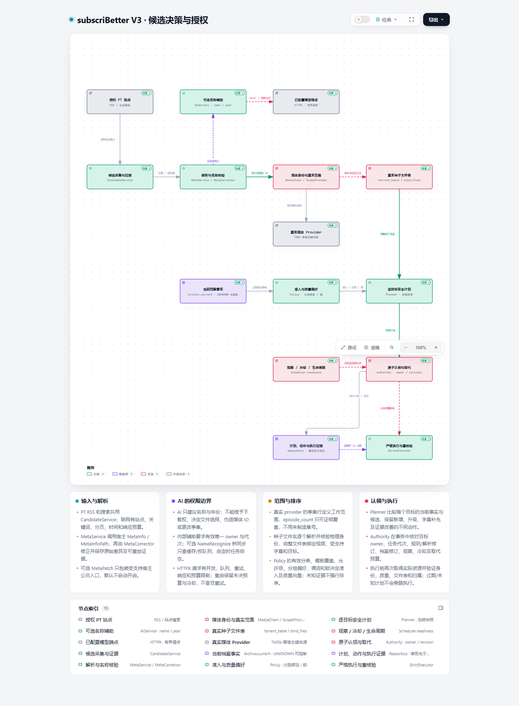
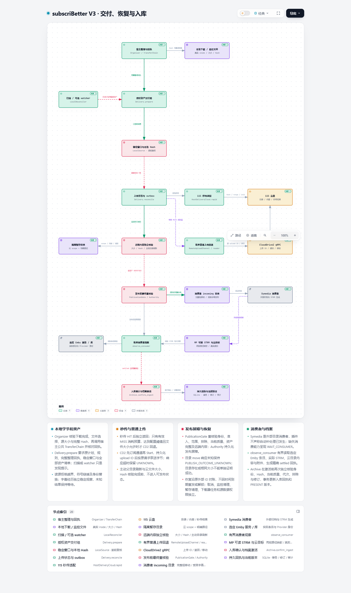

# subscriBetter V3 完整架构图集

下载 [subscribetter-full.html](subscribetter-full.html) 后用浏览器打开。这个单文件入口内嵌三张 Archify 完整交互图，保留主题、搜索、聚焦、路径探索、源码说明和导出功能。

[完整交付包](subscribetter-architecture-complete.zip) 包含原生 HTML、可编辑 JSON、源码快照、Archify 运行包与许可证、生成脚本、浏览器截图和校验回执。完整包内的 README 记录重生成命令及原始工作目录。GitHub 文件预览不会运行 HTML，请下载后打开。

| 视图 | 节点 / 关系 | 可编辑输入 | 原生完整图 | 最终校验 |
| --- | --- | --- | --- | --- |
| 完整架构总览 | 22 / 26 | [overview.json](overview.json) | [overview.html](overview.html) | [回执](review-2/overview.finalize-summary.json) |
| 候选决策与授权 | 15 / 15 | [decision.json](decision.json) | [decision.html](decision.html) | [回执](browser-verified-decision/decision.finalize-summary.json) |
| 交付、恢复与入库 | 20 / 21 | [delivery.json](delivery.json) | [delivery.html](delivery.html) | [回执](browser-verified-delivery/delivery.finalize-summary.json) |

合计 57 个视图节点、62 条关系；同一系统角色可以出现在多张图中。覆盖宿主注册、配置与管理员 API、迁移和唯一 owner、RSS 发现、身份与名称解析、候选和质量决策、任务授权、下载和整理、云端交付与恢复、库存核验和入库、持久化及管理界面。

## 源码与工具依据

分析范围是 2026-09-30 当前 `plugins.v3/subscribetter` 的 146 个受版本管理文件，包含提交前的质量策略和界面修改。来源工作树原 HEAD 为 `7ce7120cdad1a334893908b448f4343954bf6660`；独立本地源码快照为 `d4b405fab16e501bff0d798f2a1dd325bb8bb43a`。图中的快照引用仍标记为 `local-only`，不会把合成快照冒充 GitHub 提交。快照及 Git 对象保存在完整包内，文件摘要见 [source-snapshot.json](source-snapshot.json)。

对应源码现已提交为 [c99edeb](https://github.com/eitelkeit0708/MoviePilot-Plugins/commit/c99edeb9d0252ab3245923f4baa5b192bfeeb2bf)；提交前确认这 146 个文件全部与图集快照一致。图集保留生成时的来源身份及原始回执。

使用 [tt-a1i/archify](https://github.com/tt-a1i/archify) 3.0.1，工具提交 `d5a1333d7447c866a765adac7d4d062f2f02e4d2`，运行完整渲染与 `showcase` 校验流程。可编辑输入以本目录的最终 JSON 为准；完整包中的初稿生成脚本不包含最终布局修正。

## 验证与范围

- **PASS**：三张图的 `validate / deliver / check / browser-check` 全部通过；每张图的严格产物检查均为 9 项，零诊断。
- **PASS**：桌面 1440、1600、1920、2048 px 容纳、亮暗主题及可读性检查通过；人工检查三张 2048 px 亮色截图、三张 1440 px 全页截图和总览暗色截图。
- **PASS**：Windows / Chrome 153.0.8010.54 实际打开三张原生图及单文件入口，三视图切换、源码说明、JSON 下载和脚本错误检查通过。390 px 检查仅证明入口导航容纳。
- **PASS**：提交副本的三张原生 HTML 和单文件入口 SHA-256 与 [交付清单](delivery-manifest.json) 一致。浏览器证据见 [package-browser-review.json](package-browser-review.json)，人工视觉记录见 [perceptual-review.json](perceptual-review.json)。
- **NOT_RUN**：本轮没有连接 NAS、下载器、115、CD2、Symedia、Emby 或模型服务，图表检查不代表插件部署或真实媒体链验收。

总览保留一处 owner 路线与来源输入交叉，颜色与箭头方向可区分。完整包保留早期失败记录，以本页链接的最终校验回执及交付清单中的 HTML 哈希为准。

## 预览

