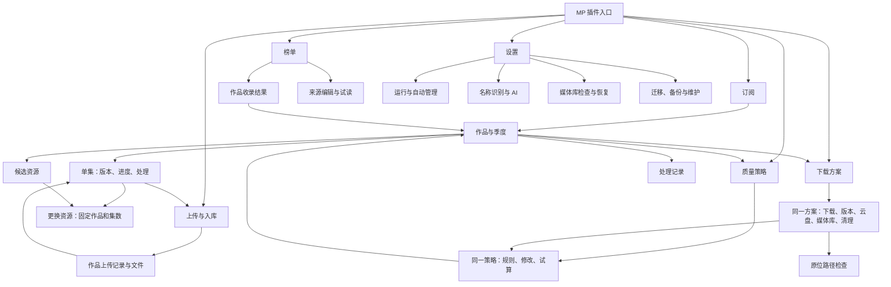

# subscriBetter：完整前端体验设计

状态：**文档已获认可作为实施依据；实现已进入隔离 V3 复核，视觉仍待用户认可。** 2026-09-27。

本提案替代“沿 R2 逐页补丁”的方向。重构前产品为 `b987ed8`，此前材料为 `4166c50`；本轮实施及证据见 [IMPLEMENTATION.md](IMPLEMENTATION.md)。保留后台能力、数据、安全约束与正确行为，重新设计全部普通入口、页面关系和连续操作。局部 QA 通过不构成整体视觉或体验认可。

## 1. 成品应该是什么

一个在 MoviePilot 内使用的媒体管理界面：先认出作品，再看收录和处理情况，需要时在当前作品、当前集、当前策略或当前方案中完成操作。

不新增另一套订阅创建流程；不重写质量算法。普通页面不展示 JSON、内部 ID、配置引用、版本摘要值或操作回执。用户不需要理解对象之间如何保存，系统负责携带上下文、校验影响范围和恢复输入。

本轮设计是一套产品，不是几个独立的好看样板。文末能力覆盖表是实现范围；高级能力不删除，普通任务不以跳进高级诊断作为最后一步。

## 2. 实际参照与当前问题

本次直接打开隔离 MP 的原生电视剧订阅、编辑订阅弹窗和推荐媒体页，查看截图与计算样式；没有保存原生订阅。

参照的具体元素：媒体封面与标题配对、清楚的栏目标题、Vuetify 表单与按钮、页签、底部保存栏、关闭位置。采集到正文 16px/24px、表单高度 56px、输入圆角 16px，宿主暗色 background 为 RGB(11,19,34)、surface 为 RGB(24,34,53)、primary 为 RGB(141,81,249)。这些是当前宿主的观测值；实现读取宿主主题，不把暗色值写死。插件正文仍采用稳定表面，不复制宿主背景光斑对表单的干扰。

私有环境截图只保留本地；公开设计图采用示例作品与示例状态。设计图不是运行截图，也不证明示例进度发生过。

已核对的代码问题：

- `PolicyOverview.vue → Page.configure → Config.vue → Policies.vue` 只传配置分组，没有传当前分类、策略、作品和返回位置。
- `SettingsOverview.vue` 九个入口之后，`Config.vue` 再展示十二组导航。
- 发现列表的已识别/待识别筛选不代表已管理/未加入；关联入口跳到通用数据视图。
- 上传页面来自交付组分页，不覆盖所有下载任务；不能把这一页改名为完整任务中心而不补数据。
- `Task` 展示合同没有 poster 字段；仅组件支持图片不等于真正接入图片。
- `/policies/simulate` 使用当前运行策略；`/configuration/policy-summary` 只描述草稿。二者目前都不能替“未保存修改试算”背书。

代码基线：[前端](https://github.com/eitelkeit0708/MoviePilot-Plugins/tree/b987ed8d0d77ba1249b95c0c51c58817130068da/plugins.v3/subscribetter/frontend/src)、[展示接口](https://github.com/eitelkeit0708/MoviePilot-Plugins/blob/b987ed8d0d77ba1249b95c0c51c58817130068da/plugins.v3/subscribetter/ui.py)、[配置合同](https://github.com/eitelkeit0708/MoviePilot-Plugins/blob/b987ed8d0d77ba1249b95c0c51c58817130068da/plugins.v3/subscribetter/configuration.py)。

## 3. 完整页面关系

保留 MP 的插件入口。打开后只有一层业务导航：**订阅、榜单、上传与入库、质量策略、下载方案**。右侧是 **设置** 和宿主关闭按钮。不再另造 sB 标识或第二条品牌栏；插件名称只出现在宿主标题。紧凑模式标记只说明实际执行范围，详情按需打开。

“设置”直接打开设置内容，不经过功能目录。“下载方案”“质量策略”“榜单来源”只在各自任务中编辑，设置中不再出现另一套入口和编辑器。

图中的返回箭头代表恢复直接调用位置，不是重新进入空白列表。嵌套编辑使用有界的返回栈，每层保留选定对象、页签、筛选、分页、滚动、焦点，以及外层未保存草稿和读取时的配置基线；逐层返回，不用后一次跳转覆盖前一次记录，不另造路由框架。密钥不进入持久化返回记录。

### 页面构成

| 页面 | 主体与视觉重点 | 主要动作 | 有意收起的信息 |
|---|---|---|---|
| 订阅 | 60×90 左右的小封面/自然文字回退；作品名、季、收录数；最多三条具体活动 | 查看作品；接管已有 MP 订阅 | 内部状态、时间戳、旧错误 |
| 作品详情 | 小封面、标题、季度选择；版本进度为主；候选/记录为次级页签 | 对当前集处理；查看当前策略/方案 | 原始文件名、证据字段 |
| 榜单 | 更适合浏览的封面与作品摘要；收录结果和原因同卡 | 查看收录结果；明确执行重新检查 | RSS 地址、抓取日志 |
| 上传与入库 | 按作品/季度组织的紧凑队列；阶段、阻塞、下一步 | 在当前问题旁检查/继续/取消 | 文件组身份、外部操作标识 |
| 质量策略 | 策略名称、使用范围、允许版本、比较顺序；编辑与试算共处 | 修改、试算本次修改、保存并返回 | 原始表达式、历史版本 |
| 下载方案 | 名称、用途、下载器与媒体库；连续配置 | 新建、编辑、检查、保存 | 内部关联与稳定 ID |
| 设置 | 一层分区直接显示表单：运行、搜索与等待、名称识别、媒体库检查、维护 | 对当前分区保存 | 完整诊断对象 |

## 4. 订阅和作品详情

### 列表

“订阅”标题与常用动作一行。作品搜索与筛选在下方，正常时不展示说明段落或安全通告。已保存可靠海报就使用；没有图片不渲染醒目的空盒子，标题位置保持稳定，以小类型图标辅助。

作品行不再固定套 collection/progress/actions 三个槽位：左侧媒体身份，中部在库情况与版本摘要，右侧主要活动；窄屏先作品、再活动、最后收录。没有活动的作品不为一个“已暂停”撑出一大块区域。

筛选包括全部、处理中、需处理、已暂停和完整状态选择。**前三者的数量和筛选必须由后端在分页前计算**，未接通前不拿当前页统计冒充全局；未知总数不显示“全部完成”。

### 详情

打开作品后是全宽详情，不恢复挤压内容的左右两栏。作品标题旁就能看当前分类、策略、下载方案；点名称直接进入对应对象，带上返回作品及集数。

分集行桌面顺序为：集号 → 当前版本 → 本次目标与变化 → 当前阶段和下一步 → 当前适用动作。存在多个库内版本时可展开逐个比较，不能任意挑一个代表全部；存在多项改善时全部突出，降低维度明确标记，不能把“第一个决定维度胜出”画成所有维度都提升。

手机主行示例：

> 第 3 集　等待字幕
>
> DDP → 无损音频
>
> 视频已就绪，字幕尚未齐备
>
> 查看详情

有两项以上变化就换行列出全部有意义的变化，不截取前两个规格。点开后才并列完整规格与依据。首次下载显示“尚未在库 → 待下载版本”；没有在途任务且已收录显示正常在库状态，不强调“没有升级目标”。

### 单集动作

每个动作固定当前作品、季、集和资源。核对、重试、更换资源、暂停、检查媒体库不能让用户再选择内部对象。

“更换资源”是一个完整局部流程：选候选 → 看这次影响哪些集、当前下载与已有文件如何处理 → 后台预检 → 明确确认 → 返回同一集看结果。共用整季资源可能涉及多集时，必须列出实际影响；不能为了文案顺畅说成只影响这一集。未知外部结果时不提供可点击的重新上传，显示核对入口与确切原因。

候选页按资源聚合：能补齐哪些集、能升级哪些集、哪些不处理和原因。展开再读取完整比较依据；失败保留摘要与“重新加载”。历史按最新优先分页，不在前端反转一小页冒充最新。

## 5. 榜单：作品和收录结果是主角

榜单选择显示可读名称。默认显示作品，不常驻多个来源状态面板。来源异常只显示简短影响提示；“管理来源”在同页打开相应来源编辑，关闭后恢复榜单和滚动位置。

收录结果独立于身份识别：

| 显示给用户 | 含义与就近动作 |
|---|---|
| 已由 subscriBetter 管理 | 点开具体作品/季度；多季时先显示实际季，不进高级表格 |
| MP 中已有订阅 | 显示是否由本插件管理；未接管时使用既有接管流程 |
| 未加入 | 直接给具体原因，例如分类未配置、评分/年份不满足、用户已停止管理 |
| 等待识别 | 说明缺少哪项身份信息、是否安排重试；不得等同于未订阅 |
| 读取结果待确认 | 保留上次结果，提示更新时间；可重新读取 |

“重新判定”改为“重新检查收录条件”。点前能知道这会按当前规则重新识别，并可能创建或接管订阅；不是一个伪装成纯读取的按钮。仅测试 RSS 的动作叫“试读榜单”，明确只读取条目，不触发识别或订阅。

来源编辑包含 RSSHub 服务地址、实际榜单选择、类型、更新频率和准入条件；高级路由仍可输入并保留 `@@TV / @@Movie` 兼容。只用自部署地址，默认不提供失效公开路由。来源保存、试读和执行处理是不同动作，在同一上下文给反馈。

历史来源可查看既有结果，不能对已移除来源显示能执行的按钮；隐藏历史不改变用户停止、排除和已处理记录。

## 6. 上传与入库：准确覆盖它负责的流程

明确命名“上传与入库”，不称完整任务中心。作品的下载进度在订阅详情，未进入上传流程时不会出现在本页；空页自然说明这一点并提供返回订阅，不制造缺失任务的错觉。

作品/季度为一级条目，后端聚合后分页；同作品多个处理批次展开查看，不能只把当前页文件组拼起来。尚无法关联作品的历史批次在“未关联作品的历史记录”中完整保留，不胡乱合并标题相同的电影和剧集。

每个批次显示“等待文件齐备 → 秒传/上传 → 交给 Symedia → 媒体库已确认”的真实阶段；阶段未知时明确未知，不能把已交给 Symedia 渲染成已入库。平时只显示正在发生的一段，完整过程展开看。

当前阶段旁给动作：检查云端结果、重新检查文件、检查媒体库、继续上传或取消本次处理，名称来自真实阶段。取消与删除分开。涉及删除时单独列确切对象、路径、共用关系与保留内容，服务端未允许就不能提交。

文件明细优先显示视频和必要字幕；大小、上传字节和最后检查时间有事实才展示。现有 IDX/SUB、字体、许可附件的排除范围不扩大。

## 7. 质量策略：看、改、试算、保存是一件事

策略列表与当前编辑对象位于同页；进入路径带着分类、策略及返回作品。默认模式是阅读完整规则，“编辑”就在同一个对象上变为表单，不打开十二组设置导航。

普通编辑采用允许分辨率选择、发布组/片源规则选择、可展开的规则名单、可用键盘上下移动的优先顺序、明确锁定项。复杂自定义条件使用有字段、运算符和值的专用编辑器；保留精确表达式入口，但不得把整份配置交给通用 Field/Record。不能无损表示的现有规则必须保留并以明确高级入口展示，不能在普通保存时静默丢弃。

**尊重真实作用域**：当前模板可被多个分类共享，而 `policy.locks / overrides / admission` 是全局策略配置。进入编辑时就显示当前策略名称、使用它的分类和方案；全局字段另列为“所有策略的限制”，进入该区即显示影响范围，保存前再次核验。不能到保存时才首次提示共享影响，不能把全局字段伪装为这部作品的专属设置，也不默认提供后台不存在的任意策略复制能力。

试算区就在规则旁/下方：选当前版本与候选，使用本次草稿，展示允许/拒绝/等待、决定因素和各维度变化。试算不写运行配置、不消耗观察时钟、不触发搜索或下载。没有真实样本可以手填有边界的样本字段并标“手填样本”；不能冒充真实资源验证。

改任一相关字段立即撤销旧试算结果。保存前列出共享分类和方案影响；保存回读成功才显示“已保存”。回读失败显示“保存结果未确认”，保留草稿，先读取确认而非盲目再发。

保存后先返回直接进入本页的对象：作品 → 方案 → 策略，应先回到方案继续编辑，再返回原作品及集数。策略保存并回读后，更新外层方案草稿中对应策略的引用和版本，撤销受影响的旧试算/检查结果，保留其他输入、选定对象和位置；不能整份重置草稿，也不能继续展示旧策略的成功结果。直接从作品进入策略时，主动作才是“返回《作品名》第 X 集”。若宿主要求切换配置面板，切换由组件内部完成；用户不承担对象重新定位。

## 8. 下载方案：围绕一份方案完成全部配置

方案页直接是有名称和用途的列表，不经过设置目录。新建与维护使用同一编辑器，名称可改，稳定 ID 由系统保留。

以五个可返回的步骤组织：

1. **用途与版本**：方案名称、MP 实际分类、完整质量策略；可就地调整所选策略并回到本步骤。库内比较策略与订阅策略分别来自真实配置，不能误画为同一字段。
2. **下载**：宿主下载器、“下载保存到”、实际站点、替换词；请求预算收起，缺失服务保留原选择并提供重试。
3. **上传与整理**：“从哪里上传”、已有 CD2/115 连接、授权路径、“115 暂存目录”和“Symedia 接收目录”；这些都是本步骤的普通字段，显示用途和重叠错误。秒传间隔、有效未命中上限、回退上传及大小限制在本步骤编辑。
4. **媒体库与路径检查**：按 Emby 服务选择实际媒体库名，四条全宽路径前缀；直接选授权样本检查当前草稿，不要求启用追踪或保存后绕回来。
5. **检查与保存**：阅读这份方案的实际用途、共享影响、错误与未验证项；修改处可返回。保存失败留在本页，字段与选择全部保留。

主流程明确呈现：下载器保存文件 → MP 完成整理 → 插件监控整理输出目录 → 115 暂存 → 交给 Symedia。

| 字段 | 用途 |
|---|---|
| 下载保存到 | `Destination.save_path`，下载器使用的保存目录 |
| 从哪里上传 | `DeliveryRule.local_root`，MP 整理完成后插件监控的本地目录 |
| 115 暂存目录 | 视频与必要字幕准备齐全的位置 |
| Symedia 接收目录 | 完整文件组交给现有 Symedia 容器处理的位置 |

前两个目录分别配置，不默认相同，不自动互相填充；设置上传来源不能顺带授予下载目录或保种目录的清理权限。每一步只出现一次标题，下一步与保存固定在底部。错误定位到字段，不把原始 schema 错误堆在顶部。已保存对象暂时无法取得名称时显示“已保存的媒体库，名称暂不可用”，不能把媒体库 ID 变成可编辑输入框。

分别配置不等于一律禁止相同目录；用户有意选择相同路径时，仍由既有目录和权限校验判断能否运行及清理。

路径检查主链路必须是：Emby 的 STRM 文件 → MP 可读文件 → 文件内本地挂载路径 → CD2 内部视频路径。结果显示四段完整路径与每一步是否检查；前缀改变、样本改变、配置版本变化立即撤销旧结果。HTTP 内容只作为附加案例。

无样本时留在此步骤说明“此库暂无可用 STRM 样本”，提供刷新样本/选择另一已授权媒体库。草稿路径超出既有可读根目录时明确未验证，不能因只读检查而扩大本地文件权限。保存不等于检查成功；允许保存哪些未验证项由原配置校验决定。

共享连接、映射或规则有变化，保存前列出受影响方案的可读名称与实际字段；只修改显示名称不宣称会迁移目录。不主动复制一份共享对象来掩盖影响。

清理权限作为方案“清理与保留”局部区块，显示该规则的授权及全局上限。用户不能在局部编辑里无提示打开影响所有方案的全局权限。

## 9. 设置：只放全局行为，一层抵达表单

| 分区 | 常用内容 | 同页高级内容 |
|---|---|---|
| 运行与自动管理 | 启停、演练、自动接管电影/剧集、自动升级的媒体库、升级期限 | 完成判定、整季处理、单次任务期限 |
| 搜索与等待 | 站点范围、观察等待、冷却、更换下载中的版本 | 搜索预算、关键词来源、精确排除与期限、替换次数/时长限制 |
| 名称识别 | MP 名称增强、保护名称标签、AI 开关、地址/模型/密钥、连接检查 | 提示词、预算、缓存、规则优先顺序、样本差异 |
| 媒体库检查 | 扫描范围、周期、故障后恢复、当前服务情况 | 有界补扫、失败路径、消费者补处理、独立只读路径检查 |
| 维护与安全 | 五项清理权限上限、容量限制、并发与超时、备份、旧插件迁移 | 精确恢复、原始诊断、历史记录维护 |

设置选中分区后立即见内容，不再展示下一层目录。每次保存保留未编辑范围，当前编辑范围按用户期望的完整结果提交，包含删除；不把其他页面未提交草稿一起发送，不用递归合并补回已删除的键。例如取消 4K 分辨率锁后，保存并回读的配置中该锁必须不存在。提交前以进入编辑时的基线核对最新配置，共享字段和并发变化单独核验；冲突时保留输入，不静默覆盖。预检、宿主保存、回读仍沿用既有合同。

### AI

同一表单输入地址、模型和密钥，已有密钥显示“已配置”，不回显。主操作“保存连接并检查”在一次用户动作中顺序执行私密写入、配置保存和有界模型请求；界面分别报告结果。私密写入成功而配置失败时明确“密钥已写入，连接设置未保存”，可在原表单继续，不谎称事务整体回滚。模型检查可能产生费用，在按钮旁短说明一次；只读本地解析测试不冒充连通模型测试。

不恢复聊天、Telegram/微信模块。AI 只辅助识别。提示词和高级规则保留全宽编辑与恢复默认的精确确认。

### 迁移与维护

迁移仍覆盖导入备份、读取旧榜单、接替旧插件三类任务，但按选择来源 → 查看差异和冲突 → 明确切换范围 → 保存并确认完成组织。系统携带所需记录，不让用户复制粘贴回执。出错回到当前步骤并保留输入；旧插件禁用、唯一处理者、回滚仍用原安全流程。

原始诊断只作为用户主动进入的工具；业务页对异常的解释和处理必须完整，不能用“去高级诊断”代替一个未实现的普通操作。

## 10. 一套组件规范，允许不同页面长得不同

- 直接复用当前已安装的 Vuetify 和 MP 主题；不加组件库、不另造全局 reset、不增加外部字体。
- 正文 16px/24px，辅助信息最低 14px/20px；标题用字号、字重和位置建立层级。重要旧版本、重试次数不做低对比脚注。
- 背景、surface、文字、主色、成功/注意/错误均来自宿主变量；暗色与浅色一起设计。正常等待是中性状态，待核对是注意，确认失败才是错误。
- 桌面常用控件 40–48px，长表单用 56px 输入；触控主按钮/行操作有效区域至少 44px。不能靠缩字和挤掉间距完成手机适配。
- 列表、浏览卡片、队列、规则编辑和路径表单使用不同专用布局；只共用按钮、表单、状态反馈和媒体身份等真正相同的部分。
- 页面只有一个主要内容滚动区；对话框自己滚动，表单底栏固定。详细编辑用整页，局部确认用弹窗，不叠三层弹窗。
- 返回在页面左上，关闭沿宿主右上；保存始终在表单底部主操作；危险动作离开主要动作区，确认时给出确切影响。
- 加载显示局部骨架和明确状态；服务失败保留最近结果、时间及重试；读取错误的主提示不出现“不自动重发操作”。原始状态码放展开详情。
- 图标使用宿主已有图标；封面只消费已有可信元数据/缓存路径，不逐条临时请求 TMDb/豆瓣。损坏图片回退后不循环重试、不泄露媒体标识。

### 保存、离开、冲突

只读无变化时不用确认关闭。有普通未保存修改时询问保留草稿/放弃/继续编辑；密钥不进 sessionStorage、日志或导出。跨页面编辑返回后恢复草稿，跨刷新恢复普通草稿，恢复后重新读取服务端基线。

放弃外层方案草稿，只放弃该层尚未保存的修改，不回滚已保存并回读确认的子策略。确认界面只列出本次流程实际保存过的子编辑及其仍然生效的事实；需要撤销时返回该策略重新编辑，不能假装多个独立保存是一个事务，也不能提供后台不存在的撤销能力。

并发修改时保留本地输入，显示“哪些已保存字段变了”和具体共享影响；不自动覆盖。保存结果未知时先核对原请求。只有配置读取确认了新值，才显示成功并解锁后续依赖检查。

## 11. 必要的接口与状态改动

这些是完成体验所需的最小支撑，不改变业务引擎。实现时先复用已有查询和校验，再加以下缺失部分。

| 缺口 | 最小补齐 | 明确不能做什么 |
|---|---|---|
| 跨页只传 group | 逐层保存作品/季/集、分类/策略/方案身份、位置、外层草稿与基线；子编辑保存后更新相关引用并撤销旧检查；服务端仍校验对象 | 不用页面标题作身份；不把密钥放持久化返回状态；不覆盖外层返回记录 |
| 策略只模拟生效配置 | 草稿试算复用 Policy 和同样校验，返回草稿指纹及比较事实；结果只属于该草稿 | 不临时保存生效配置来试算；不污染观察与候选时钟 |
| 发现只展示原始记录 | 后端给收录结果、明确原因、关联作品/季、当前可用动作；筛选在分页前完成 | 不从“identity 有值”推导已经订阅 |
| 上传按批次分页 | 先按可信任务/作品/季度聚合再分页，提供批次展开；保留无法关联的历史记录 | 不跨页遗漏批次、不按相同标题强行合并 |
| 列表缺可靠封面 | 有界读取已有宿主元数据与已存身份，返回可用图片/缺失；复用现有代理规则 | 不整库抓图、不为好看填错作品封面 |
| 处理中/需处理 | 依据真实计划和允许动作分类并给全局计数，保留有界查询范围 | 不把等待字幕/秒传一律当错误 |
| 通用 Action/Record 承担普通动作 | 每项常用动作有专用输入、预览与结果组件，继续使用原授权和预检接口 | 不删除预检、不让前端替服务端认定操作可用 |

Page 和 Config 可以保留为宿主协议的薄入口，内部共享同一套页面与草稿管理。是否能完全消除宿主切换需在真实挂载合同上验证；即使宿主必须 switch，用户上下文也必须自动还原，不能作为设计退让理由。

## 12. 全能力落位：不拆期、不缩水

| 既有能力 | 新入口 / 保留方式 |
|---|---|
| 订阅、接管、暂停、观察、停止、交还 MP、恢复宿主订阅 | 订阅/作品操作；带作品名与影响范围 |
| 按集/季范围、数值排序、分页、多个库内版本 | 作品详情与范围编辑 |
| 真实下载、秒传次数、下一次时间、未知结果核对 | 分集行与上传队列；各读实际记录 |
| 候选搜索、刷新、比较、原始证据、排除、撤销、更换资源 | 作品候选及当前集局部流程 |
| 逐目标观察、冷却、替换次数、升级期限、整季策略 | 作品说明及全局搜索/等待、自动管理设置 |
| 策略维度、锁、覆盖、自定义准入、规则名单、试算 | 同一质量策略工作区；明确全局与模板作用域 |
| 版本档案、附件、Hash、位置、逻辑失效 | 作品版本详情；失效动作说明不删除媒体 |
| 下载器原始 ID 核对、暂停上传、阶段恢复、消费者确认 | 对应上传或分集上下文，技术详情可展开 |
| 文件清单、共用引用、上传与发布保护 | 批次文件详情与精确操作预览 |
| 五项清理权限 | 全局维护上限 + 方案实际授权；不捆绑开启 |
| 方案分类、下载器、站点、路径、替换词、显示名称 | 下载方案连续编辑 |
| 云盘范围、115 父目录、暂存隔离、Symedia 入口 | 方案上传与整理；必要内部绑定由系统维护 |
| Emby 媒体库、两段 STRM 映射、扫描范围、已有/草稿检查 | 方案路径页与媒体库检查设置 |
| 秒传重试、回退上传大小、无限制开关、通知、稳定等待 | 方案上传选项，不缩为几个预设 |
| 本地监控、补扫、失败路径、容量、并发、网络限制 | 上传来源在方案上传与整理；补扫与检查在媒体库检查，容量/并发/网络限制在维护设置 |
| 本地 RSSHub 全部内置/自定义榜单、限流缓存、过滤、重试、隐藏历史 | 榜单来源与结果页面 |
| MP 解析增强、保护名称、AI 提示词/预算/缓存/私密连接、样本重放 | 名称识别设置与样本页；不含聊天 |
| 备份导出、导入、旧榜单迁移、唯一处理者、切换/回滚 | 维护内的连续迁移流程 |
| 原始九域诊断与完整证据 | 主动进入维护诊断，不能是普通任务的必经页 |

## 13. 最终验收按完整任务进行

以下每条都在真实 MP 挂载内执行，并记录起点、操作、结果和返回位置；合成数据用于补足状态覆盖，但不代替真实外部操作验证。

1. 订阅筛选 → 作品 → 第 7 集 → 编辑方案并保留未保存输入 → 修改所用策略 → 用本次草稿试算 → 保存回读 → 返回方案：策略引用已更新，相关旧检查已撤销，其余输入与位置保留 → 保存方案 → 返回原作品第 7 集。直接编辑策略也回到原入口；没有重新定位对象或丢掉筛选、位置、焦点。

   同一路径另测：策略保存成功后放弃外层方案；未保存的方案目录恢复，已保存策略继续生效，放弃确认准确说明这个范围。
2. 等待秒传的某集 → 更换资源 → 看到确切影响集数与已有文件处理 → 后台预检 → 执行/未知结果核对 → 返回同一集；任何共用批次的额外影响都有显示。
3. 空配置 → 新方案 → 服务暂不可用 → 重试 → 选真实分类/完整策略 → 分别配置下载保存目录、MP 整理后的上传来源、115 暂存、Symedia 接收目录 → 四段路径检查 → 保存失败 → 输入保留 → 保存成功回读。没有要求手工输入引用或媒体库 ID，没有把下载目录自动当作上传来源。
4. 进入共享策略/方案编辑时即看见使用范围 → 取消已有分辨率锁 → 外部同时修改 → 保留本地输入 → 查看变动和受影响方案 → 明确解决冲突 → 保存回读。被取消的锁确实不存在，未编辑范围保留最新已保存值，其他页面草稿没有混入；没有静默覆盖。
5. 榜单中已管理、原生已有、未加入、待识别分别有准确结果 → 打开相应作品/来源 → 返回原榜单；重新检查的副作用明确。
6. 同作品两个上传批次 → 展开各自文件 → 一个未知、一个已入库 → 操作只作用于选定批次，取消不偷偷清理。
7. AI 私密写入成功、配置保存失败 → 原表单显示两步事实 → 恢复保存 → 模型检查；没有泄露密钥，也没有假整体成功。
8. 迁移预检失败/处理者冲突 → 原流程修正 → 切换与回读 → 必要时恢复；不用复制回执。
9. 浅/深色、宽屏/窄屏、无图/有图、长片名、多季/多版本、多项升降、未知总集数、空/加载/服务失败、键盘焦点、触控连续操作都覆盖。手机不以“未溢出”作为通过条件。

状态只记 PASS / FAIL / BLOCKED / NOT_RUN，并注明实际数据或合成状态。**全部正常页面纳入同一次交付；没有“样板通过所以其余页面也通过”的推论。** 用户视觉认可单列，必须来自用户，不能由作者填写 PASS。

## 14. 实施与本次评审范围

本文件已作为实施依据，整套正常页面及设置已接入正式组件，并部署到隔离 MP。实现、原始截图及连续操作的证据边界见 [IMPLEMENTATION.md](IMPLEMENTATION.md)；尚未完成的真实业务场景和用户视觉认可单列，不以局部验证代替完整验收。

技术顺序：统一上下文与保存状态 → 补齐只读展示/草稿试算合同 → 完整业务页与专用编辑器 → 清除旧编排及冲突 CSS → 实际宿主连续任务验收。既有正确的安全/行为测试继续跑；视觉验收必须看实际页面和完成任务，不按测试数和截图数决定完成。

设计图中的示例数值、封面和活动都属于示意。实施时没有对应事实就显示未知或空态，不为了还原图片编造后台数据。

### 概念图与实际实现的取舍

- 图 02：规格直接高亮各项改善与降低；不重复添加“提升分辨率”等同义徽标，额外文字用于说明选择原因与取舍。
- 图 04：保留作品、批次、文件层级，内部使用缩进和分隔线，避免层层套框。示例禁用取消不代表所有未知结果都禁止取消；取消、停止后续工作、删除、重新上传分别按后台许可处理。
- 图 01、03、08：封面、活动条数、暂停和空态采用自然内容高度，不照搬示意图每屏数量。多项变化完整呈现，避免重复图标和说明。
- 图 05：字幕声明不构成新增质量档；仅沿用满足既定条件时从 PGS 推定到发布者明确标注的同质量替换例外，并保留文件关联确认。
- 图 06：以第 8 节最新步骤为准，使用“上传与整理”，在普通流程中提供“从哪里上传”。
- 图 07：显隐按钮只能查看本次新输入的密钥；历史密钥只显示“已配置”，没有回显入口。

文档已获认可作为实施依据；概念图仅确定方向，实际 UI 的视觉与可用性仍待真实宿主验收。
