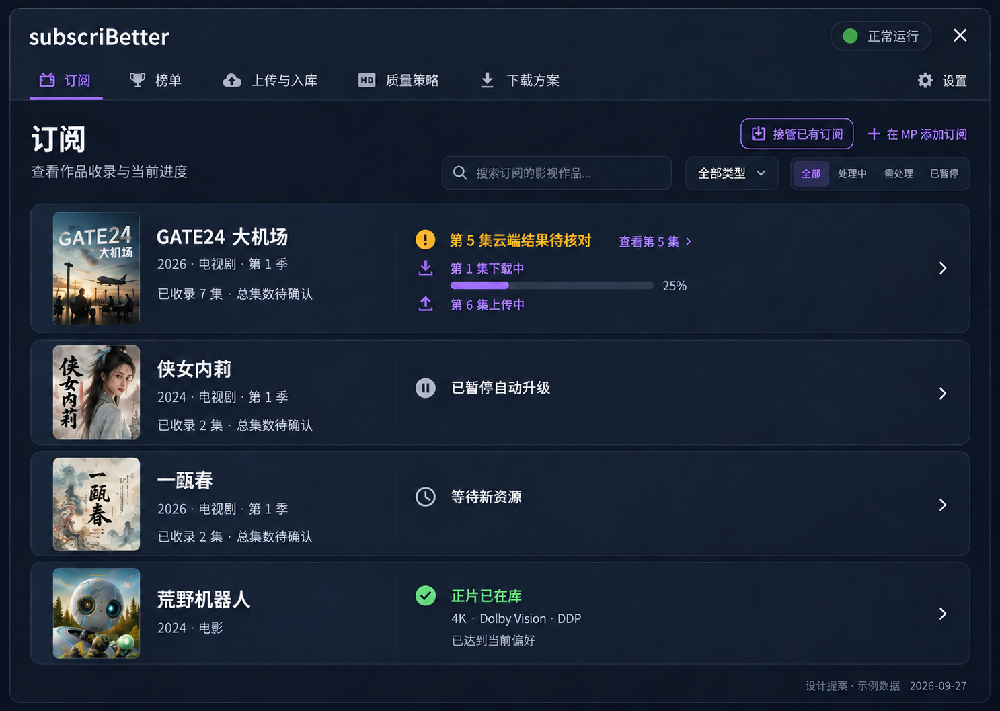
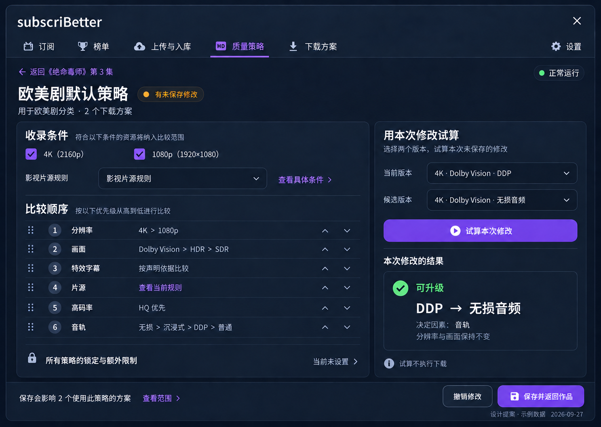
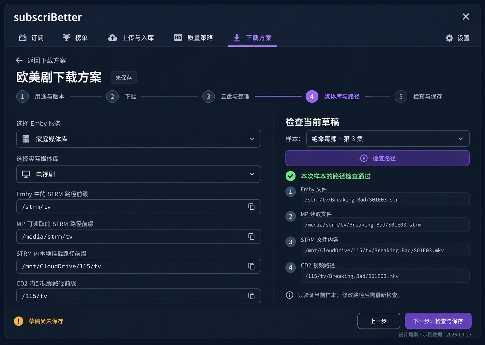

# 完整前端体验重构 · 设计评审

**状态：设计提案，未获视觉认可，未实施。** 本次没有修改或部署产品代码；隔离 MP 仍运行 `b987ed8`。

先看[完整设计与页面关系](DESIGN.md)，再看下列界面。设计覆盖全部普通入口、完整设置、迁移与高级能力，图是关键界面的视觉表达，不是以几张图代替全产品设计。以后的验收按连续任务完成情况判定。

## 这次改变的使用方式

- 进入一部作品的策略，就继续编辑这份策略；草稿试算、保存、返回原集数在同一条操作路径。
- 下载方案是独立业务入口，目录、媒体库、完整策略和路径检查都围绕这一份方案完成。
- 榜单直接解释收录结果；上传与入库按作品组织它实际负责的流程。普通操作不会再通往通用对象编辑器。
- 设置只有一层分区，直接呈现全局表单；各业务页保留自己的局部设置。

## 同一套设计的关键界面

这些是 **AI 生成的设计图，不是浏览器截图、可点击原型或真实运行证据**。封面为示意插画，不能用于身份核验，也不会作为正式媒体封面带入产品；正式实现只读取已有可信元数据。时间、数量、服务名、路径与处理结果均为示例，不代表用户当前环境。

[下载八张设计图原件 ZIP](subscriBetter-design-originals-1941efe.zip)：包含 `1941efe` 的八张 PNG 与原始 `manifest.json`，未缩放或重新编码，逐张 SHA256 与原清单一致。本次仅在设计文档补清下载目录与上传来源、嵌套编辑恢复、分区保存的删除和共享作用域；图片与产品代码未改动。

| 界面 | 重点看什么 |
|---|---|
| [订阅](concepts/01-subscriptions.png) | 作品辨识、收录与具体活动；异常直接定位到集 |
| [作品详情](concepts/02-work-details.png) | 多项版本变化同时突出；操作就在对应集旁；策略与方案带上下文跳转 |
| [榜单](concepts/03-discovery.png) | 已管理、未加入、待识别、原生已有分别解释，不用“已识别”代替订阅结果 |
| [上传与入库](concepts/04-upload-ingest.png) | 作品下不同进程分别展示；未知结果有检查入口；不伪装成完整下载任务中心 |
| [策略编辑](concepts/05-policy-editor.png) | 当前对象不丢失，试算本次草稿，保存后回到原作品；共享影响明确 |
| [方案路径检查](concepts/06-plan-paths.png) | 当前方案内选择媒体库、填写四个本地路径前缀、选择样本检查 |
| [设置与 AI 保存失败](concepts/07-settings-ai.png) | 一层设置直达表单；私密写入与配置保存的部分成功得到准确反馈 |
| [手机作品详情](concepts/08-mobile-details.png) | 先看实际变化与动作，展开后才看完整规格 |

图的尺寸由生成工具返回，见 [manifest.json](manifest.json)，没有称其为 1440px/390px 的实际浏览器渲染。生成图不是字段清单或实现合同，完整字段、作用域和行为以 DESIGN.md 及既有后台合同为准。图中的装饰性图标、徽标密度和较强按钮填色也不是必须逐像素照抄的资产；真实宿主实现时要保持正文可读，避免重复描述相同的版本变化。

## 连续任务，而非截图计数

[设计文档第 13 节](DESIGN.md#13-最终验收按完整任务进行)规定了九条任务，包括：

1. 作品 → 指定集 → 当前策略 → 修改和草稿试算 → 保存回读 → 回到原集，保持筛选、位置和焦点。
2. 等待秒传的集 → 更换资源 → 明确整季共用资源的实际影响 → 执行或核对 → 返回当前集。
3. 空配置 → 建立方案 → 服务失败后重试 → 当前草稿路径检查 → 保存失败保留输入 → 保存确认。
4. 榜单收录结果、同作品多个上传进程、共享配置冲突、AI 部分保存、迁移冲突分别在各自流程中处理。

## 本次完成与未完成

| 项目 | 本次状态 |
|---|---|
| 真实 MP 视觉参照 | 已打开订阅页、编辑弹窗、媒体推荐页并采集样式；未保存原生订阅 |
| 当前前端问题核对 | 已核对策略跳转、双层设置、发现关联、上传范围、封面字段和策略试算调用 |
| 完整页面关系及能力落位 | 已写入 DESIGN.md，供审核 |
| 关键视觉提案 | 本目录 8 张设计图，供审核；不构成可用性证据 |
| 产品代码、正式部署、真实连续任务 | NOT_RUN，本轮尚未实施 |
| 可点击性、键盘与触屏、全部浅色/缩放状态 | NOT_RUN，不能由生成图片证明 |
| 用户视觉认可 | 待用户确认，不能由作者或测试代填 |

外部审核只需本目录和文中的固定 GitHub 源码链接，无需私有地址、SSH、账号、旧 ZIP 或 fnos.txt。请评价完整操作路径是否自然、作用域是否准确、关键视觉是否值得实施；不要将图中示例成功状态计入业务验收。
