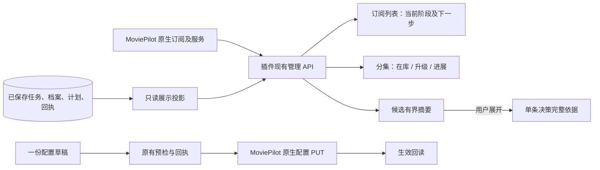

# 设计与接口审查

固定产品 `30c0bd105e5c6800b1c94d806a342eaeaf67f9a8`，以下链接均固定此提交。

## 页面与事实来源

[`ui.py:510`](https://github.com/eitelkeit0708/MoviePilot-Plugins/blob/30c0bd105e5c6800b1c94d806a342eaeaf67f9a8/plugins.v3/subscribetter/ui.py#L510) 的列表只读投影最多读取每任务 6 份仍属当前计划且代际有效的目标样本，阶段来自已有 [`display.py`](https://github.com/eitelkeit0708/MoviePilot-Plugins/blob/30c0bd105e5c6800b1c94d806a342eaeaf67f9a8/plugins.v3/subscribetter/display.py)。列表标注样本覆盖数；总量仍来自现有聚合。不按行请求外部下载器、媒体库或新增身份识别。

[`UnitProgress.vue`](https://github.com/eitelkeit0708/MoviePilot-Plugins/blob/30c0bd105e5c6800b1c94d806a342eaeaf67f9a8/plugins.v3/subscribetter/frontend/src/UnitProgress.vue) 消费 `current_quality` 和 `processing`，不解析文件名反推规格；`processing` 的文件、传输和下一步仍受原来计划所有权/围栏约束。多版本在详情逐项显示，跨集文件声明共享。可靠字节计数范围外不画进度。发布者声明与测得字段由 `basis` 区分。

[`CandidateDecision.vue`](https://github.com/eitelkeit0708/MoviePilot-Plugins/blob/30c0bd105e5c6800b1c94d806a342eaeaf67f9a8/plugins.v3/subscribetter/frontend/src/CandidateDecision.vue) 列表使用 `summary`，不读取被剔除的 `evaluation`。分组只在同一候选内部，以状态、原因、维度相同为条件；仅压缩返回的真实集号。完整详情取得后数值排序，再前端分段显示。服务端分集分页数值排序、计划列表显式 `sort=newest` 保持此前实现。

## 布局取舍

普通内容采用 MP 主题实色表面；主题色只强调选中项、主要按钮与有意义状态。正文按 15px、次要信息约 13px 建立层级，作用域限定插件。没有引入新的视觉依赖或全局宿主 CSS。

桌面把当前/升级/进展横向放在同一集；手机把两版并列，阶段置于下面。简短模式持续可见，技术说明展开。五业务域、全宽详情保持，方案编辑只显示方案抬头、步骤、当前字段和单一底部操作。

本轮没有把海报当主视觉，也没有逐行新增封面请求。后台未提供的封面不合成；当前通过作品名与年份辨认。无触屏可用性、色彩对比度工具或读屏软件全量认证。

## 保存与共享关系

[`PlanSetup.vue`](https://github.com/eitelkeit0708/MoviePilot-Plugins/blob/30c0bd105e5c6800b1c94d806a342eaeaf67f9a8/plugins.v3/subscribetter/frontend/src/PlanSetup.vue) 和 [`plan-flow.mjs`](https://github.com/eitelkeit0708/MoviePilot-Plugins/blob/30c0bd105e5c6800b1c94d806a342eaeaf67f9a8/plugins.v3/subscribetter/frontend/src/plan-flow.mjs) 在继续前检查必需依赖；最终后端仍是合法性裁决者。共享修改列出实际变更字段和关联方案，不自动复制共享对象。方案名称仍是现有稳定 ID，因此暂不支持已保存方案重命名。

[`Config.vue`](https://github.com/eitelkeit0708/MoviePilot-Plugins/blob/30c0bd105e5c6800b1c94d806a342eaeaf67f9a8/plugins.v3/subscribetter/frontend/src/Config.vue) 使用已有 API 适配器 `api.put('plugin/'+pluginId, config)`，保留原有预检及 receipt。提交未知后禁止重复写，仅允许回读核对；界面不得把旧成功状态用于新草稿。草稿保留在当前浏览器 sessionStorage，绑定插件与基线摘要，不储存密钥原文。私密输入离开时有未保存保护。

共享云盘可能包含多个库，本轮不捏造「方案唯一媒体库」外键。恢复事件携带用户刚选的映射，扫描开关只作用该库；全局运行开关明确影响所有方案。两份库同时存在时的目标绑定有组件回归。

## AI 显式连接测试

[`ai.py:667`](https://github.com/eitelkeit0708/MoviePilot-Plugins/blob/30c0bd105e5c6800b1c94d806a342eaeaf67f9a8/plugins.v3/subscribetter/ai.py#L667) 为明确连接测试提供受限上下文，正常名称辅助仍依赖生产启用条件。已有 AIService 处理请求、正负缓存、并发、速率、密钥轮换和持久预算，不另写 HTTP 客户端。配置指纹、generation、能力就绪和重叠处理者约束仍检查。

[`ui.py:746`](https://github.com/eitelkeit0708/MoviePilot-Plugins/blob/30c0bd105e5c6800b1c94d806a342eaeaf67f9a8/plugins.v3/subscribetter/ui.py#L746) 验证管理员和配置围栏，只测试固定样本，普通结果不回传私密端点或密钥。`__init__.py` 在有完整连接配置时可创建测试用 service，但只在启用 bridge 时装载生产事件监听器。本轮真实测试未开启生产 AI。

## 能力范围

没有移除或改写质量决策、逐集档案、观察冷却、计划取代、上传与发布、STRM、五类清理授权和未知结果保护。新增核心逻辑限于展示投影与显式测试入口；其他主要是既有业务的呈现和连续配置。本轮不是对这些能力全量真实链路的重新放行，见原有台账与本包 VALIDATION.md。
