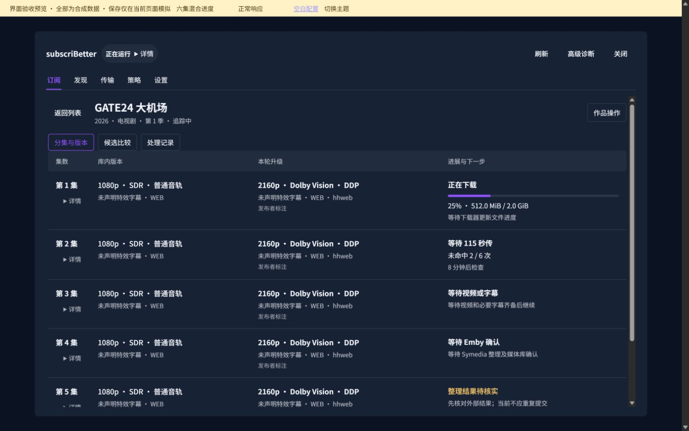
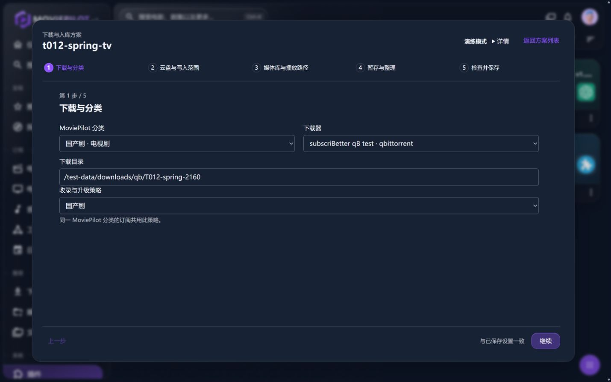
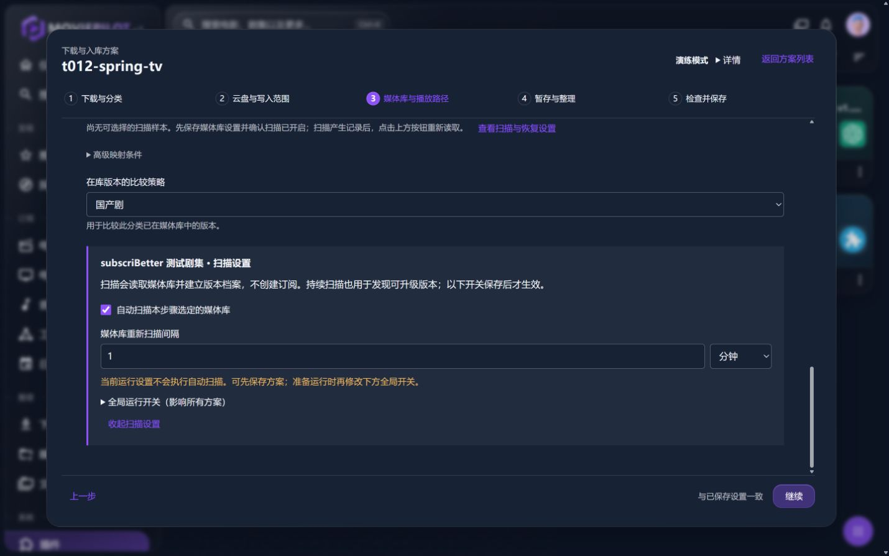

# 原图清单

共 35 张，全部为浏览器原图。**最终优先看45–54，39仍适用聚焦布局。其余用于实现过程与状态覆盖，不冒充统一最终构建。**

PNG 为早期 2× 截图，JPEG 为可见标签原生 viewport 截图；不能按像素宽直接推算 CSS 字号。保存时未绘制、拼接或替换界面。

| 图 | 内容 | 环境 | 源码边界 | 原图像素 |
|---|---|---|---|---|
| [synthetic/10-shared-change.png](synthetic/10-shared-change.png) | 实际共享字段修改影响 | 合成 | 实现阶段，83df7c4 提交前的工作区快照 | 2880×1800 |
| [synthetic/11-ai-unconfigured.png](synthetic/11-ai-unconfigured.png) | AI 未配置 | 合成 | 实现阶段，83df7c4 提交前的工作区快照 | 2880×1800 |
| [synthetic/12-ai-partial-save.png](synthetic/12-ai-partial-save.png) | AI 私密写入部分成功 | 合成 | 实现阶段，83df7c4 提交前的工作区快照 | 2880×1800 |
| [synthetic/13-ai-saving.png](synthetic/13-ai-saving.png) | AI 保存中 | 合成 | 实现阶段，83df7c4 提交前的工作区快照 | 2880×1800 |
| [synthetic/14-ai-configured.png](synthetic/14-ai-configured.png) | AI 已配置待测试 | 合成 | 实现阶段，83df7c4 提交前的工作区快照 | 2880×1800 |
| [synthetic/15-ai-testing.png](synthetic/15-ai-testing.png) | AI 测试中 | 合成 | 实现阶段，83df7c4 提交前的工作区快照 | 2880×1800 |
| [synthetic/16-ai-test-failure.png](synthetic/16-ai-test-failure.png) | AI 合成失败 | 合成 | 实现阶段，83df7c4 提交前的工作区快照 | 2880×1800 |
| [synthetic/17-blank-required-fields.png](synthetic/17-blank-required-fields.png) | 空白方案缺项检查 | 合成 | 实现阶段，83df7c4 提交前的工作区快照 | 2560×1440 |
| [synthetic/18-mapping-long-paths-1280.png](synthetic/18-mapping-long-paths-1280.png) | 空白方案长路径 | 合成 | 实现阶段，83df7c4 提交前的工作区快照 | 2560×1440 |
| [synthetic/19-blank-review-before-save.png](synthetic/19-blank-review-before-save.png) | 空白方案保存前 | 合成 | 实现阶段，83df7c4 提交前的工作区快照 | 2560×1440 |
| [synthetic/20-blank-saved.png](synthetic/20-blank-saved.png) | 空白方案模拟保存完成 | 合成 | 实现阶段，83df7c4 提交前的工作区快照 | 2560×1440 |
| [synthetic/27-expanded-final.jpg](synthetic/27-expanded-final.jpg) | 1280 展开版本详情 | 合成 | c8d2165 实现阶段快照 | 1265×712 |
| [synthetic/28-focused-mobile-final.jpg](synthetic/28-focused-mobile-final.jpg) | 390 聚焦编辑 | 合成 | c8d2165 实现阶段快照 | 375×812 |
| [synthetic/29-leave-guard-final.jpg](synthetic/29-leave-guard-final.jpg) | 离开草稿保护 | 合成 | c8d2165 实现阶段快照 | 375×812 |
| [synthetic/30-draft-restored.jpg](synthetic/30-draft-restored.jpg) | 返回恢复草稿 | 合成 | c8d2165 实现阶段快照 | 375×812 |
| [33-host-episodes.jpg](33-host-episodes.jpg) | 真实档案分集 | 真实隔离宿主 | c8d2165 / b615795 过渡期间（未刷新标签） | 1430×894 |
| [34-host-candidate-summary.jpg](34-host-candidate-summary.jpg) | 真实候选部分摘要 | 真实隔离宿主 | c8d2165 / b615795 过渡期间（未刷新标签） | 1430×894 |
| [35-host-discovery.jpg](35-host-discovery.jpg) | 发现 | 真实隔离宿主 | c8d2165 / b615795 过渡期间（未刷新标签） | 1430×894 |
| [37-host-policy.jpg](37-host-policy.jpg) | 质量策略 | 真实隔离宿主 | c8d2165 / b615795 过渡期间（未刷新标签） | 1430×894 |
| [38-host-settings.jpg](38-host-settings.jpg) | 设置入口 | 真实隔离宿主 | c8d2165 / b615795 过渡期间（未刷新标签） | 1430×894 |
| [39-host-focused-plan.jpg](39-host-focused-plan.jpg) | 聚焦方案 | 真实隔离宿主 | c8d2165 / b615795 过渡期间（未刷新标签） | 1430×894 |
| [41-host-mobile-plan.jpg](41-host-mobile-plan.jpg) | 390 宿主路径表单 | 真实隔离宿主 | c8d2165 / b615795 过渡期间（未刷新标签） | 390×844 |
| [42-host-ai-configured.jpg](42-host-ai-configured.jpg) | 真实 AI 已配置 | 真实隔离宿主 | b615795 | 1270×714 |
| [43-host-ai-testing.jpg](43-host-ai-testing.jpg) | 真实 AI 测试中 | 真实隔离宿主 | b615795 | 1270×714 |
| [44-host-ai-result.jpg](44-host-ai-result.jpg) | 真实 AI 成功 | 真实隔离宿主 | b615795 | 1430×894 |
| [45-host-list-final.jpg](45-host-list-final.jpg) | 最终真实订阅列表 | 真实隔离宿主 | 30c0bd1 最终构建 | 1430×894 |
| [46-host-candidate-detail-final.jpg](46-host-candidate-detail-final.jpg) | 最终真实候选详情数值排序 | 真实隔离宿主 | 30c0bd1 最终构建 | 1430×894 |
| [47-host-cancel-wait-final.jpg](47-host-cancel-wait-final.jpg) | 最终真实取消等待 | 真实隔离宿主 | 30c0bd1 最终构建 | 1430×894 |
| [48-host-library-recovery-final.jpg](48-host-library-recovery-final.jpg) | 最终真实多媒体库扫描恢复 | 真实隔离宿主 | 30c0bd1 最终构建 | 1430×894 |
| [49-synthetic-list-final.jpg](49-synthetic-list-final.jpg) | 最终合成混合任务列表 | 合成 | 30c0bd1 最终构建 | 1425×891 |
| [50-synthetic-episodes-final.jpg](50-synthetic-episodes-final.jpg) | 最终合成版本与进展 | 合成 | 30c0bd1 最终构建 | 1425×891 |
| [51-synthetic-sixth-and-unknown.jpg](51-synthetic-sixth-and-unknown.jpg) | 最终合成未知及第6集上传 | 合成 | 30c0bd1 最终构建 | 1425×891 |
| [52-synthetic-candidate-failure-final.jpg](52-synthetic-candidate-failure-final.jpg) | 最终合成比较读取失败 | 合成 | 30c0bd1 最终构建 | 1425×891 |
| [53-synthetic-candidate-loading-final.jpg](53-synthetic-candidate-loading-final.jpg) | 最终合成比较加载中 | 合成 | 30c0bd1 最终构建 | 1425×891 |
| [54-synthetic-mobile-final.jpg](54-synthetic-mobile-final.jpg) | 最终合成390分集 | 合成 | 30c0bd1 最终构建 | 375×812 |

真实宿主33–44先于最后文案/共享库修复。最终电影文案看45，取消等待看47，共享库恢复看48。早期合成10–20与最后代码有归一化/保存成功提示等小修差异，请同时看固定源码和52项回归；不将旧图的成功提示扩大到改变草稿后的状态。

### 最终代表画面

