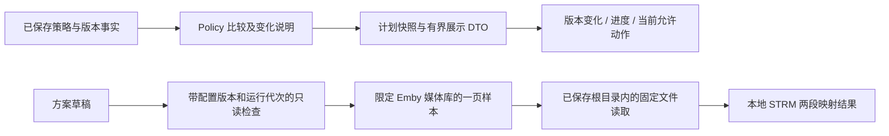

# R2 界面完整推广：外部审核材料

产品固定提交：[`62275c40ec34d5aa88c4f380b2253463b58ced46`](https://github.com/eitelkeit0708/MoviePilot-Plugins/tree/62275c40ec34d5aa88c4f380b2253463b58ced46)。比较起点：`528174d34c38da5b041cc690fa21316e239c3b97`。日期：2026-09-27，Asia/Hong_Kong。

这次已经将 R2 的媒体行、版本变化、进度与就近操作推广到正式插件，接入真实后台，并覆盖发现、传输、策略、方案、AI、迁移和高级设置。**这是实现及有限验证的交付，不是视觉认可，也不是重新放行全部业务验收。** 未执行新的 PT 下载、115 上传、清理或迁移切换。

审核者只需要 GitHub。本文、[使用步骤](USER_GUIDE.md)、同目录证据、[固定源码](https://github.com/eitelkeit0708/MoviePilot-Plugins/tree/62275c40ec34d5aa88c4f380b2253463b58ced46/plugins.v3/subscribetter)、[测试](https://github.com/eitelkeit0708/MoviePilot-Plugins/tree/62275c40ec34d5aa88c4f380b2253463b58ced46/tests/v3/subscribetter)足以复现离线部分；无需 fnos.txt、旧 ZIP、SSH 或任何密钥。NAS 结果是作者记录，外部审核者不能把它当作自己实测。

**公开证据已脱敏**：真实地址、挂载前缀、服务/方案名称、媒体库 ID 和配置摘要已替换为一致示例标识，宿主背景已移除。HTTP 结果、映射阶段、显示文案和测试断言保留；这些文件不是原始未修改的 API/DOM。原件只留在本地，不上传。详见 redaction.json。

## 范围与设计边界

| 页面 | 本次正式实现 | 主要源码 |
|---|---|---|
| 订阅 | 紧凑作品行；有限范围内列出具体集号与动作；未知总数不显示完成比例；全宽详情 | `MediaRow.vue`、`Subscriptions.vue`、`ui.py:_task_summary` |
| 分集版本 | 当前版与目标版并列；后台声明的多项提升同时突出，降低维度也显示；手机先显示变化摘要 | `VersionDifference.vue`、`UnitProgress.vue`、`display.py`、`policy.py:describe_change` |
| 候选与历史 | 有界摘要；展开单条读取完整依据；失败保留摘要；最近计划在服务端分页前降序 | `CandidateDecision.vue`、`ui.py:task_plans` |
| 发现 | 作品结果为主体；来源管理折叠；保存来源仍可原位试读 | `Discovery.vue`、`Sources.vue` |
| 传输 | 同一作品行与全宽详情；文件、进度、交付状态分开；未知结果原位核对 | `Transfers.vue`、`ReconcileButton.vue` |
| 策略 | 真实保存的维度顺序、锁定和覆盖；规则说明与精确表达式分层 | `PolicyOverview.vue`、`PolicySummary.vue`、`policy.py:describe` |
| 下载与入库方案 | 五步连续编辑；可读名称与稳定 ID 分离；内部关联自动维护；保存回读 | `PlanSetup.vue`、`Destinations.vue`、`Config.vue` |
| 路径检查 | 当前草稿选择真实 Emby 样本；不启用追踪/扫描；四段完整本地路径 | `MappingCheck.vue`、`ui.py:draft_mapping_test`、`archive.py:draft_mapping_check` |
| AI | 地址、模型、密钥与连接反馈在同页；私密写入与配置保存仍分别回读 | `AISettings.vue` |
| 迁移 | 导入备份、读取旧榜单、切换功能三个入口；实际旧插件勾选；切换记录自动携带到设置 | `Migration.vue`、`Config.vue` |
| 全部设置 | 12 组导航与专用常用控件保留，清理权限独立；高级诊断仍保留 9 个领域 | `Config.vue`、`Page.vue`、`SettingsOverview.vue` |

Field/Record 仍用于原始证据、自定义表达式等高级信息，没有删除这些能力。没有新增前端依赖，没有增加另一套质量算法、订阅创建接口或聊天功能。海报只消费已有字段，没有整库封面请求。

## 真实数据如何进入 UI



- 质量变化来自 `Policy.describe_change()`，不是前端比较字符串；每个当前版本返回各维度顺序、决定性维度和证据变化。展示最多 20 个当前版本并说明截断。基线版本不匹配时不借用旧结论。
- 多项提升可以同时出现，例如分辨率和画面上升、音频下降。紫色不等于唯一决定性因素；前端也不把“优先维度足够好”解释成其他维度都更好。
- 任务列表只检查最多 25 个有效在途目标，给出最多 3 个具体进展重点；保留抽样范围，不声称覆盖整季所有异常。
- 下载字节、次数、重试时间和检查时间只读取真实记录。没有进度时不填 0%。总集数缺可靠依据时显示“总集数待确认”。
- `ReconcileButton` 调用现有 `/health/reconcile`，绑定 bundle revision、配置版本和运行代次。它观察此前请求的结果，不重新上传、发布或清理；未知结果保持未知。自动安全任务仍按原合同运行。

## 新的只读配置接口

全部位于管理员插件 API 下，使用现有认证、runtime 与配置 fence，不放宽普通执行权限。

| POST 路径 | 输入 | 边界与输出 |
|---|---|---|
| `/configuration/library-samples` | service、library、offset、limit、config_revision、runtime_generation | 所选媒体库必须由宿主向当前用户公开；最多 25 项 Movie/Episode，仅返回 ID、名称、季集和分页信息 |
| `/configuration/mapping-check` | mapping 草稿、item_id、两个 fence | 重新核对单条样本所属库；最多 20 个 MediaSources；返回四段路径、检查时间、草稿摘要 |
| `/configuration/policy-summary` | policy 草稿、category_id、两个 fence | 实例化实际 Policy，返回当前完整顺序、锁定、准入与规则说明，不保存或执行搜索 |

路径检查的关键限制：**草稿不能扩大本地文件读取范围**。只有同一 Emby 服务/媒体库已保存映射授权的 MP 根目录可以读；使用现有固定文件读取与路径边界检查。未授权时返回 `READ_SCOPE_REQUIRED`，只展示前两段计算结果，内容未读。首次配置应保持关闭/演练，先保存读取目录，再回到第三步检查；不要求启用全局扫描或正常订阅。

四段主链：Emby STRM → MP 可读 STRM → STRM 内 `/mnt/cd2/CloudDrive/115/...` 本地路径 → CD2 `/115/...` 内部路径。这里是脱敏前缀，保留实际本地路径结构。`cloud_file_verified=false` 明确表示没有顺带断言云端文件存在。修改输入、样本或配置版本会撤销旧结果；晚到的请求不能覆盖新草稿。

只有这次明确的管理员检查返回完整路径，其他诊断继续脱敏。方案 display_name 按正常预检保存；空默认值兼容旧配置，不增加旧配置 revision；执行快照排除 display_name，改名不会使正在处理的任务失效。

## 本轮验证与证据

最终计数见 [verification.json](verification.json)，原始输出见 [backend-tests.txt](backend-tests.txt)、[frontend-tests.txt](frontend-tests.txt)、[build.txt](build.txt)。不要把重复运行次数加总成覆盖数量。

| 检查 | 状态 | 能证明什么 |
|---|---|---|
| Python 相关模块回归 | PASS，另有一个平台跳过 | 配置、权限、展示、映射、质量、执行与原有测试范围；不是 NAS 全链路 |
| Vue 组件与展示测试 60 项 | PASS | 连续方案、晚到结果、名称稳定性、候选加载、未知结果、多维变化等限定断言 |
| 正式 federation 构建 | PASS | Page/Config 与源码一起发布，不用 study 页面替代正式组件 |
| 本地正式组件浏览器检查 | PASS（限定行为） | 5 个主页面、12 组配置、迁移 3 页、样本检查成功/修改失效/失败、390px 无水平溢出 |
| 隔离 V3 安装与读取 | PASS（限定行为） | 固定文件哈希部署；5 个主页面读到真实结果；12 组设置导航；真实策略和样本；4 段本地路径；越界与旧代次拒绝；配置开关不变 |
| 非零滚动位置返回 | PASS（单一宿主场景） | 键盘进入末行、点击返回；滚动 1095.20 → 1095.20，焦点回到原作品；见 host-scroll-return.json |
| 截图及最终视觉复核 | **BLOCKED** | CUA 在本地和真实宿主均返回 `Unable to capture screenshot`，见 screenshot-blocker.json |
| 真实触屏、任意筛选/设备下的滚动返回、全套浏览器矩阵 | **NOT_RUN** | 不把一个非零滚动返回场景扩大成所有组合通过 |
| 新一轮下载/115/CD2 上传/入库/清理/AI 调用/切换旧插件 | **NOT_RUN** | 本次前端交付不改变历史业务台账 |

`01`–`19` 和 `config-*` 文本是**合成数据页面 DOM**；`host-*` 是真实宿主 DOM。它们不是截图。`02`、`18` 为补齐 8 种正式展示案例后的最终状态；其他记录覆盖其所命名页面，不可用合成动作推断真实业务。`preview.mjs` 明示合成数据，包含首次下载、正常已收录、单维和多维提升、降低、未知结果等。

### 发现并修复的问题，保留审计轨迹

1. 首次部署 `ce1fab3` 后旧配置报 `INVALID_OR_STALE_CONFIG`。新增默认字段改变规范化摘要；`dd342bb` 添加受限 schema 兼容，并排除执行快照中的显示名称。没有通过强制预检或重写用户设置绕开检查。
2. 真实 mapping-check 初次返回成功但路径为 `[PATH]`。`b4293f2` 修复管理员限定响应；测试同时发现空白配置没有 mappings 键，已使用空授权列表，仍不允许读取。
3. 完整规则展开中内置正则过长。仅在保存谓词与内置谓词完全一致时提供短解释；自定义规则明确标注并可展开精确条件，不用内置说明掩盖覆盖。
4. 迁移预览会启用插件并退出演练，可能使既有追踪/交付配置生效。`62275c4` 明确提示此范围，不再声称只有所选 AI/榜单功能受影响。本轮没有执行切换。

## GitHub 独立复现

检出上述固定提交。Python 3.12；Node 支持 `--test-isolation=none` 的版本（本机 Node 24）。从仓库根目录：

```powershell
python -m venv .venv
.venv/Scripts/python -m pip install -r tests/v3/subscribetter/requirements-review.txt
$env:PYTHONPATH='tests/v3/subscribetter'
.venv/Scripts/python -m unittest test_policy test_planner test_management test_management_display test_configuration test_native_ui test_archive test_migration_history_link test_management_spec_fix test_management_reload_fix test_management_quality_fix test_execution test_acceptance_policy_boundaries test_stale_plan_replan test_candidates test_runtime
cd plugins.v3/subscribetter/frontend
npm ci
npm test
npm run build
npm run dev
```

打开 `http://127.0.0.1:4179/dev/index.html` 查看正式组件合成预览；`?blank=1` 从空白配置开始。`dev/study-review.html` 只是历史设计样板，不是这轮正式入口。合成页的保存仅在内存模拟。Linux 对应替换 Python venv 路径及环境变量语法。

外部审核建议：先运行测试，再按使用步骤走一遍；重点核对新旧配置兼容、显示名称不进入执行摘要、四段路径不被脱敏、草稿无权扩根、失败后保留输入、显示结果与真实后台同源。不要使用 NAS 凭据，也不要在真实账户上执行迁移/清理来复现本地 UI。

既有整体架构与 Archify 图见 [外部审核入口](../../../external-review/README.md)；原生 MP 识别增强的准确挂接位置见 [识别逻辑说明](../../../external-review/native-recognition.md)。本轮不更改这两个识别挂接点，新增的是展示与只读配置检查。
