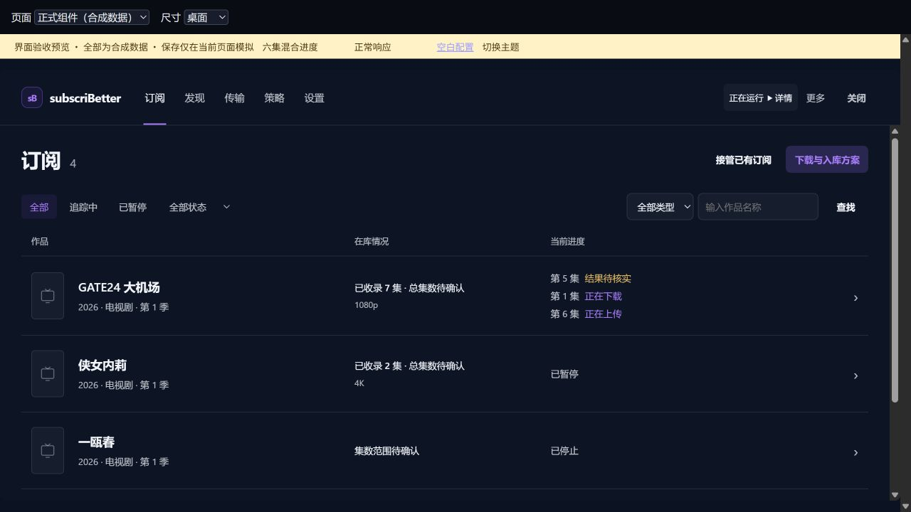
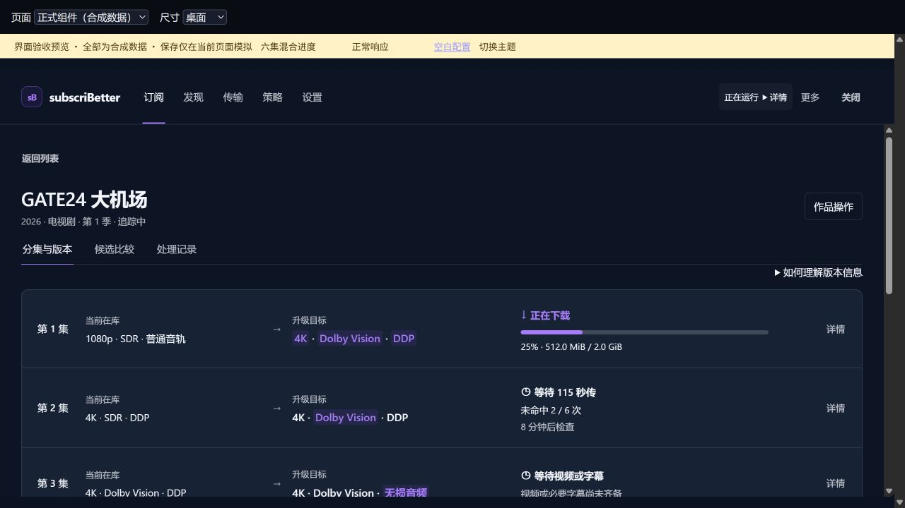

# 正式管理页视觉落实与复核

产品提交：[b987ed8](https://github.com/eitelkeit0708/MoviePilot-Plugins/tree/b987ed8d0d77ba1249b95c0c51c58817130068da)。比较起点：[62275c4](https://github.com/eitelkeit0708/MoviePilot-Plugins/tree/62275c40ec34d5aa88c4f380b2253463b58ced46)。日期：2026-09-27。

用户指出隔离 V3 的管理页仍像旧版。核对发现实际宿主已经加载此前发布的资源；问题是正式界面的页头、筛选区、作品进度和分集密度没有落实 R2 样板的层次。这次修的是正式组件和提交的 dist，已经更新隔离宿主，不是仅更新样板。用户的视觉认可仍待确认。

## 修改范围

- 单行品牌与五个功能入口；运行模式保留可见，刷新和高级工具收进“更多”。
- 订阅筛选收成一行；作品、在库情况、当前进度有清楚列头；具体集号与阶段分别呈现，不再串成一句摘要。
- 作品行沿用共享组件，发现和传输采用相同表面、层次与操作规格。
- 分集的当前版、目标版、进度、操作并列；后台提供的多项改善继续同时高亮，降低维度仍独立提示。已测得下载进度时不再重复“等待下载器更新进度”。
- 展开的版本证据占满分集行宽度；方案编辑保持足够输入宽度。未取得服务列表时显示“配置尚未取得”，不误报未绑定或零个服务。

没有改后台质量比较、权限、调度或订阅创建流程。新增订阅继续使用 MP 原生入口；高级能力和十二组配置未删除。

## 现在怎么用

1. MP 插件列表 → subscriBetter 菜单 → **查看数据**，进入正式管理页。
2. 默认看全部作品；用“追踪中”“已暂停”快速筛选，其他状态在“全部状态”中选择。筛选来自服务端，不是对当前页做假筛选。
3. 点作品行进入详情；在“分集与版本”看当前版、目标版和进度，在具体一集的“详情”中看依据与附件。适用的处理动作仍在对应分集旁。
4. “返回列表”保留刚才的作品筛选并返回原作品焦点。本轮真实宿主复验了这一条路径，未扩大为任意触屏和滚动位置保证。
5. 点列表右上“下载与入库方案”，直接进入现有方案列表。选择方案继续五步编辑；本轮仅检查真实页面入口和返回，没有保存或改变配置。
6. 发现、传输、策略、设置从顶部切换；刷新和高级诊断在“更多”。完整功能步骤仍见[上一轮用户指南](../full-rollout/USER_GUIDE.md)。

## 可公开核验的原图

下列 **13 张 JPEG 均为浏览器原图**，通过同一个预览框取图，无拼接、裁剪或内容修改。前 11 张使用正式 Vue 组件和合成数据；最后两张是 R2 对照。黄色预览条不属于正式产品。它们不证明真实下载、上传、秒传或入库发生。

| 图片 | 内容 |
|---|---|
| [01](screenshots/01-formal-list.jpg) | 正式组件订阅列表，三条具体进度 |
| [02](screenshots/02-formal-episodes.jpg) | 正式分集，第一集多维改善同时高亮 |
| [03](screenshots/03-formal-episode-expanded.jpg) | 分集证据展开后的完整宽度 |
| [04](screenshots/04-formal-mobile.jpg) | 390px 暗色 iframe，移动摘要 |
| [05](screenshots/05-formal-mobile-light.jpg) | 390px 浅色 iframe，非物理手机 |
| [06](screenshots/06-formal-discovery.jpg) | 发现 |
| [07](screenshots/07-formal-transfers.jpg) | 传输 |
| [08](screenshots/08-formal-policy.jpg) | 策略 |
| [09](screenshots/09-formal-settings.jpg) | 设置入口及未取得服务状态 |
| [10](screenshots/10-formal-schemes.jpg) | 方案列表 |
| [11](screenshots/11-formal-plan-editor.jpg) | 连续方案编辑 |
| [12](screenshots/12-r2-reference-list.jpg) | R2 订阅列表对照 |
| [13](screenshots/13-r2-reference-episodes.jpg) | R2 分集对照 |

桌面截图是 1280×720。390px CSS iframe 图保留外层画布与预览工具条，原生接口返回 1265×712 图片；未做像素归一化，不声称是手机原生或 1:1 像素截图。深浅图滚动位置不同，不能当像素级主题对照。JPEG 的 SHA-256 和尺寸见 [manifest.json](manifest.json)。





## 验证与边界

| 检查 | 状态 | 证据范围 |
|---|---|---|
| 前端自动检查 | PASS | `npm test`：62 项通过、0 失败；包括快速筛选/分页重置、具体进度、方案入口、证据展开、缺失与空服务列表区分 |
| 正式构建 | PASS | `npm run build`；对应产物随固定产品提交发布 |
| 隔离宿主更新 | PASS，作者记录 | 189 个文件校验；安装 HTTP 200/success；诊断 HTTP 200，演练开启，普通业务执行关闭，配置错误为空 |
| 实际宿主资源 | PASS，作者记录 | 页面实际样式为 `__federation_expose_Page-Dj8V5ePN.css` 和 `media-C5dSrER0.css` |
| 实际宿主有限交互 | PASS，作者记录 | 查看数据 → 追踪中 → 作品 → 分集展开 → 返回；筛选与焦点保留；方案入口 → 返回可用 |
| 图像对照 | PASS，限定范围 | 同一浏览器预览框比较 12/01、13/02；展开错误修复后重新取 03，方案宽度修复后重新取 11；详见[设计 QA](../../../../../design-qa.md) |
| 真实下载/上传/清理/迁移 | NOT_RUN | 本次视觉修正没有重新执行这些业务操作，旧台账未重新放行 |
| 用户视觉认可、物理触屏、所有缩放倍率 | NOT_RUN | 不以自动测试或截图代替用户认可 |

实际宿主截图、环境原始回执留在本地，没有上传私有地址、方案、目录与媒体库配置。外部 agent 可以独立核验公开组件、合成原图和构建，不能把上表作者记录当作自己的 NAS 实测。

实际宿主页面的已收集 error 日志为空；本地比较框曾记录两条无源码定位的 `MutationObserver.observe` 参数错误，未复现为功能失败，源码搜索未找到相应调用。此项来源未确定，不表述为“所有预览日志零错误”。

已知轻微余项：真实库内记录展开后，规格主行与补充说明可能重复字幕、片源、发布组。这不影响事实及操作，后续文案整理应保留证据来源；本轮没有将它包装为已经修复。

## 复现

检出固定产品提交，在 `plugins.v3/subscribetter/frontend` 运行：

```sh
npm ci
npm test
npm run build
npm run dev -- --host 127.0.0.1 --port 4179
```

打开 `/dev/visual-review.html`，选择“正式组件”或“R2 样板”。该入口仅属于开发预览，不出现在正式插件内。完整接口合同、业务范围、AI 与迁移说明继续参见[上一轮材料](../full-rollout/README.md)，此文只修正其视觉落实和截图阻断结论。
