# 榜单

[返回总目录](README.md)

长页面按分段顺序查看；点击图片可打开原图。

## 本图册目录

- [榜单入口](#10-boards)（1 张）
- [榜单作品与收录状态](#11-board-works)（2 张）
- [榜单运行记录](#12-board-runs)（1 张）
- [榜单统计](#13-board-statistics)（1 张）
- [单个榜单来源设置](#14-board-settings)（3 张）
- [RSSHub 与全局规则](#15-board-global)（4 张）
- [榜单历史显示设置](#16-board-history-settings)（1 张）

## 榜单入口

`10-boards-01`

## 榜单作品与收录状态

### 第 1 / 2 段

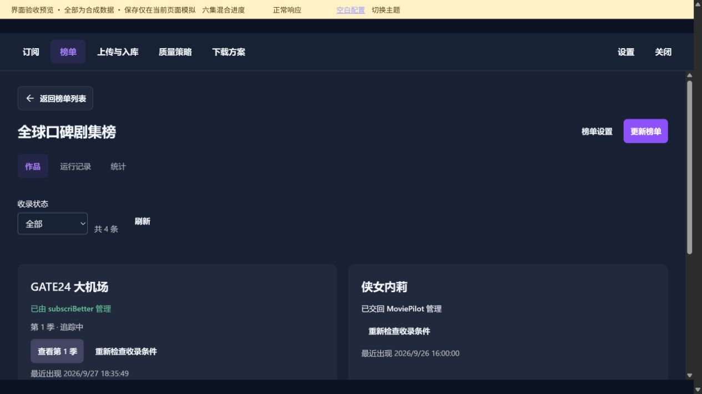

`11-board-works-01`

### 第 2 / 2 段

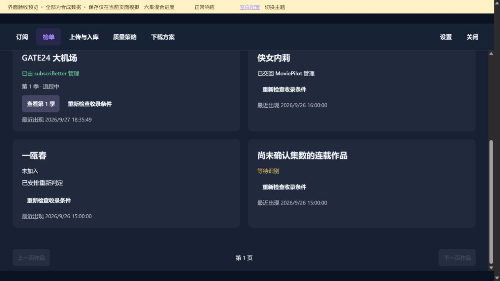

`11-board-works-02`

## 榜单运行记录

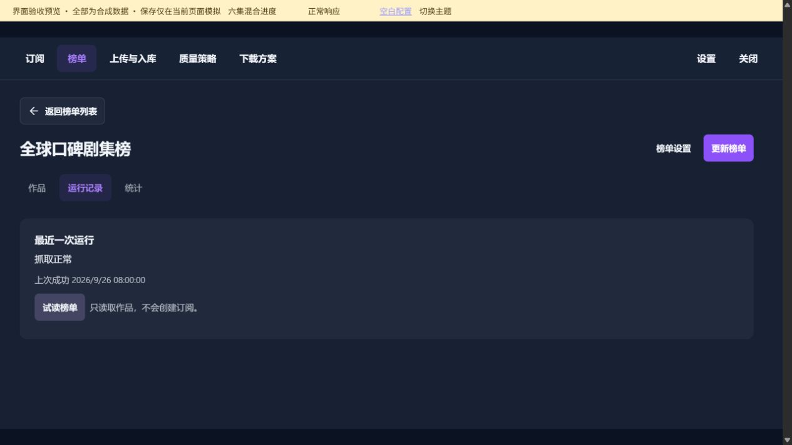

`12-board-runs-01`

## 榜单统计

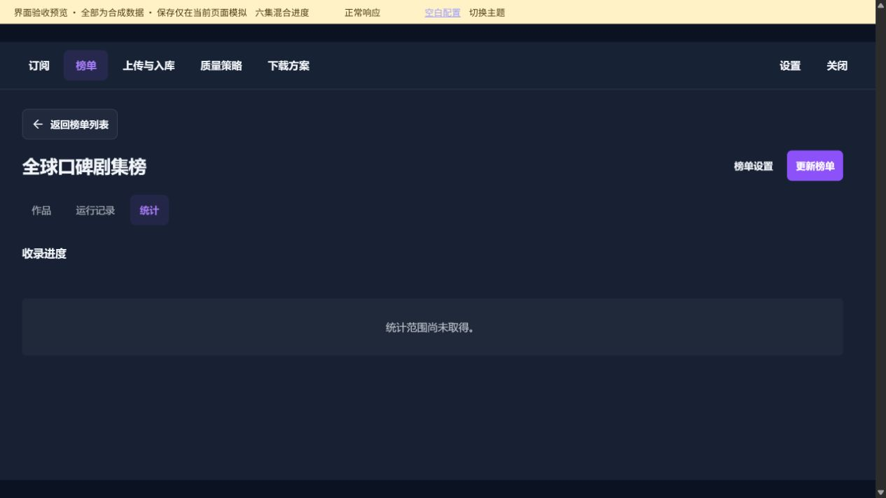

`13-board-statistics-01`

## 单个榜单来源设置

### 第 1 / 3 段

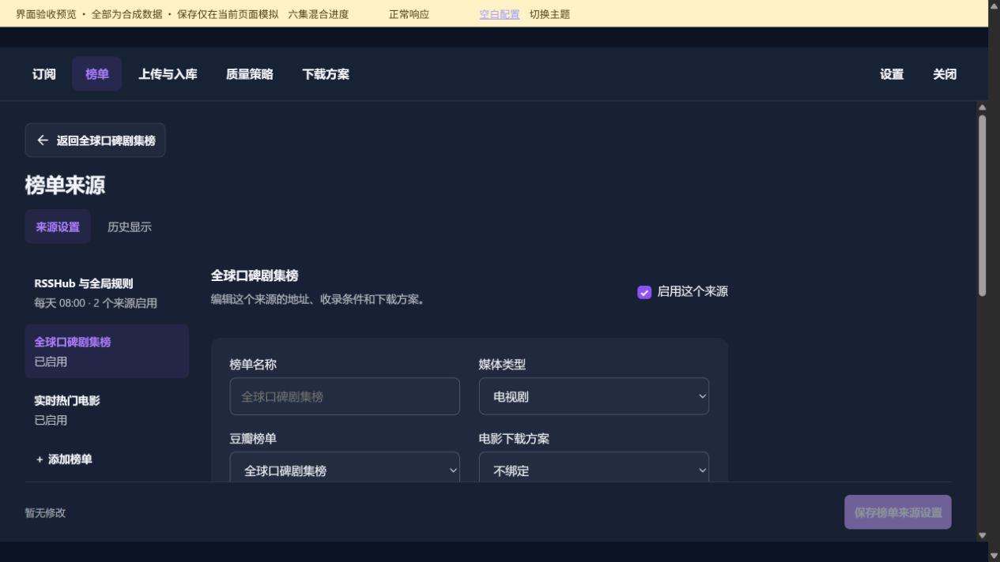

`14-board-settings-01`

### 第 2 / 3 段

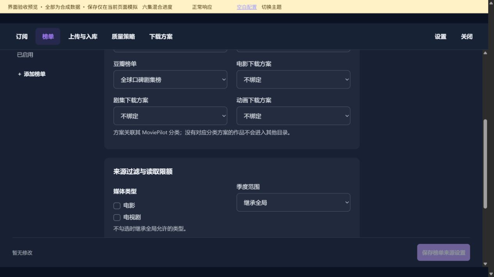

`14-board-settings-02`

### 第 3 / 3 段

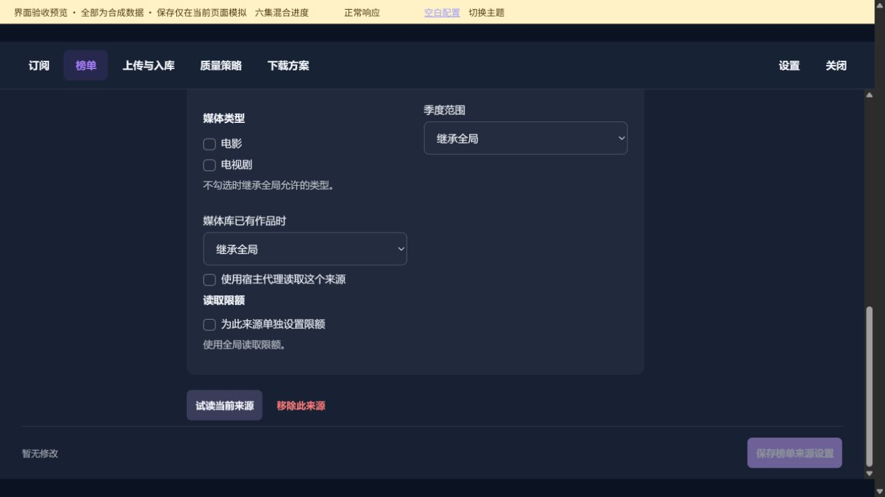

`14-board-settings-03`

## RSSHub 与全局规则

### 第 1 / 4 段

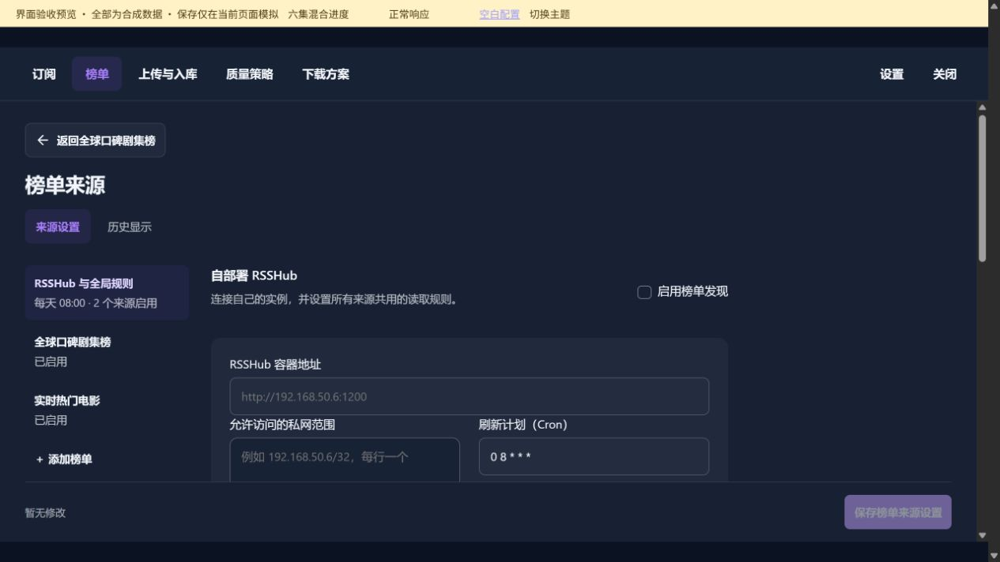

`15-board-global-01`

### 第 2 / 4 段

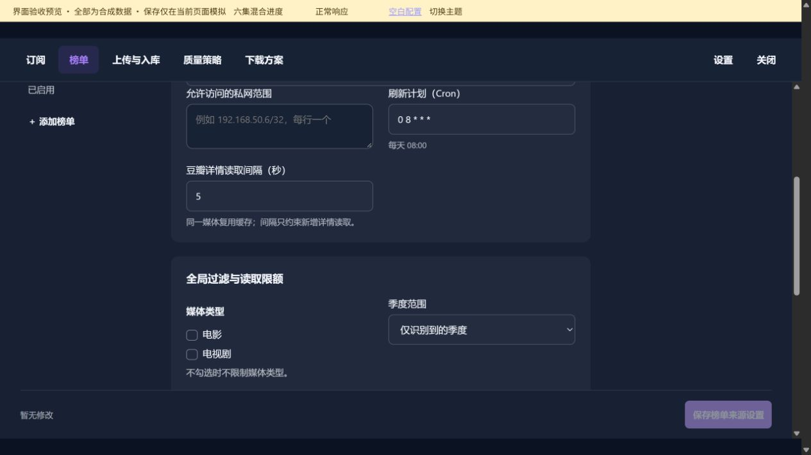

`15-board-global-02`

### 第 3 / 4 段

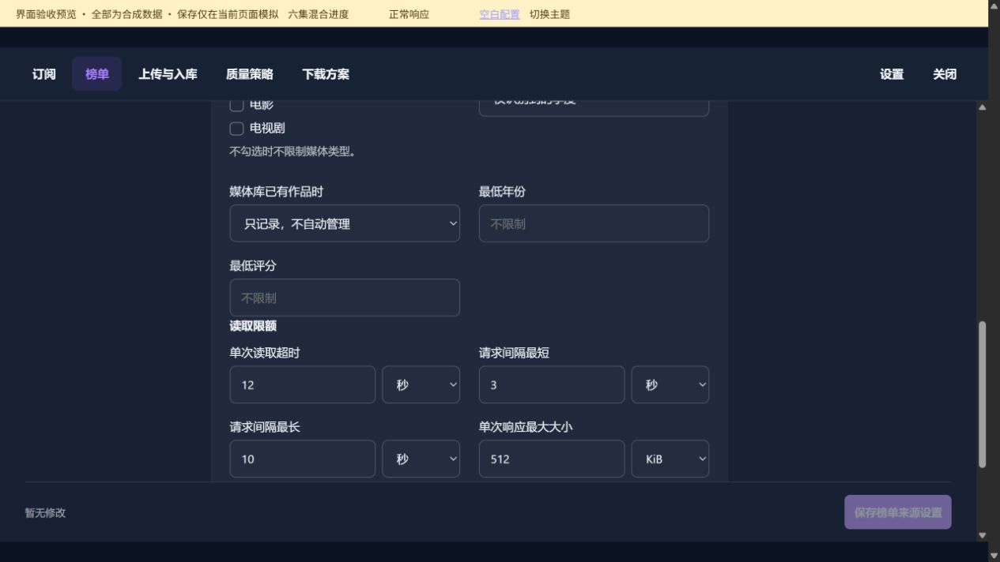

`15-board-global-03`

### 第 4 / 4 段

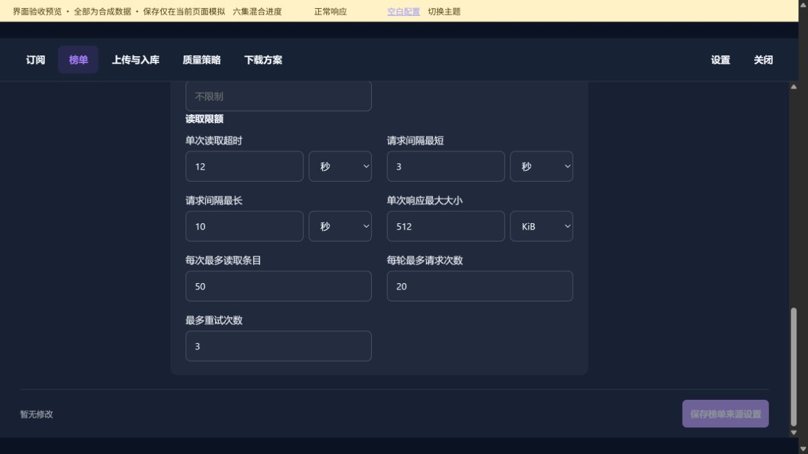

`15-board-global-04`

## 榜单历史显示设置

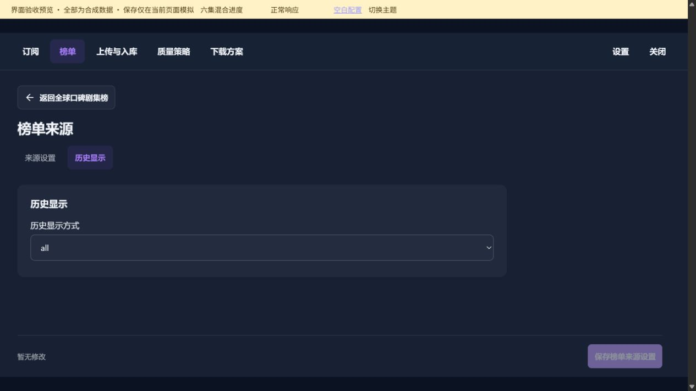

`16-board-history-settings-01`
