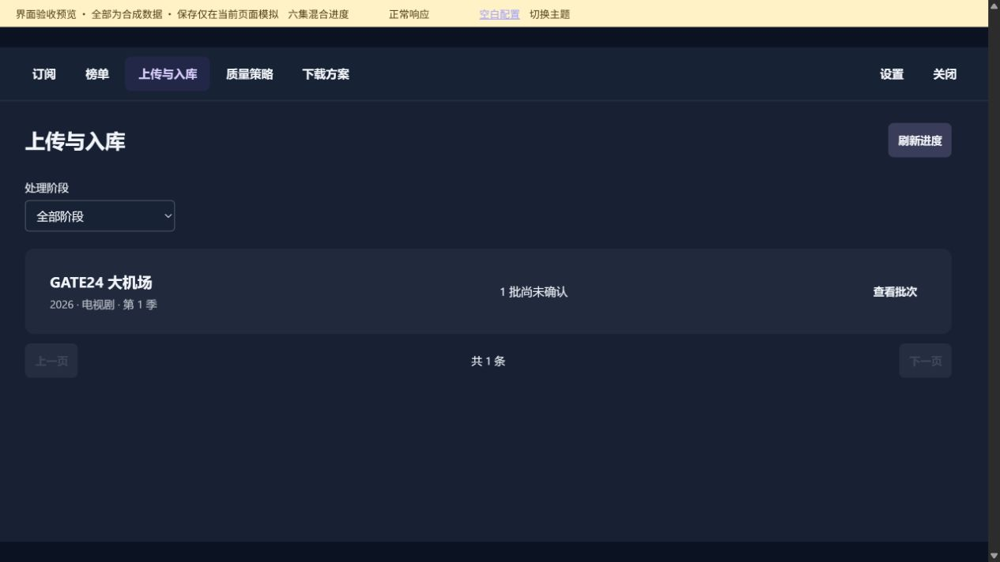
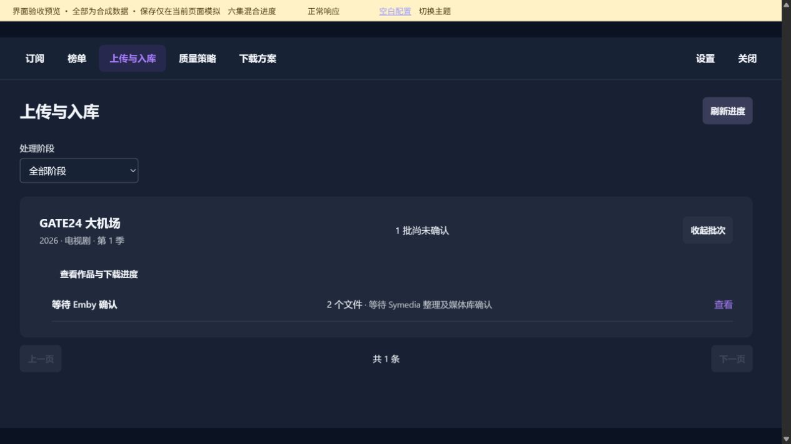
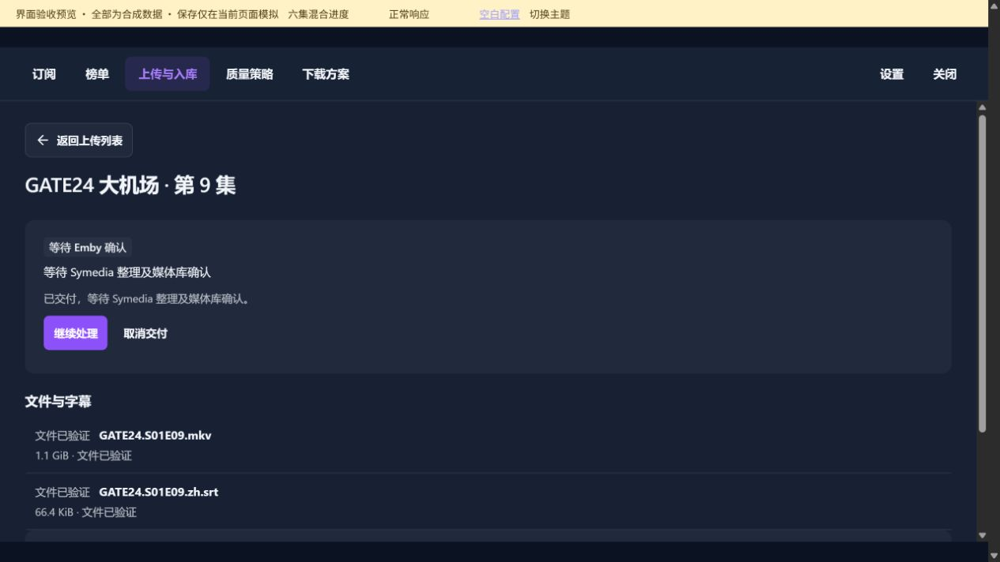
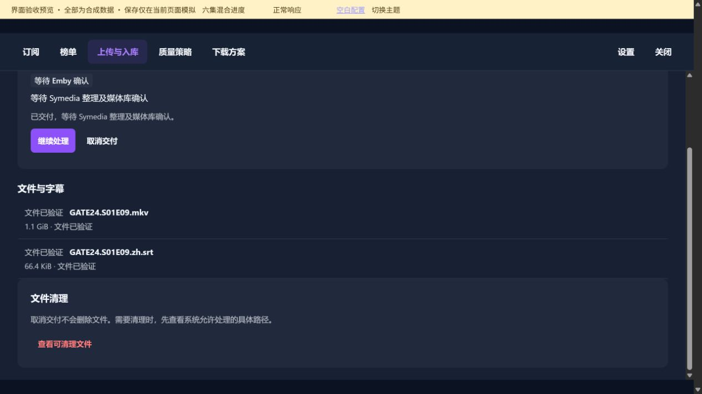

# 上传与入库

[返回总目录](README.md)

长页面按分段顺序查看；点击图片可打开原图。

## 本图册目录

- [上传与入库列表](#17-transfers)（1 张）
- [作品交付批次](#18-transfer-batches)（1 张）
- [交付详情、文件与清理入口](#19-transfer-detail)（2 张）

## 上传与入库列表

`17-transfers-01`

## 作品交付批次

`18-transfer-batches-01`

## 交付详情、文件与清理入口

### 第 1 / 2 段

`19-transfer-detail-01`

### 第 2 / 2 段

`19-transfer-detail-02`
