# 质量策略

[返回总目录](README.md)

长页面按分段顺序查看；点击图片可打开原图。

## 本图册目录

- [杜比视界主类与规格优先级](#20-policy-dv)（4 张）
- [设置同等优先：选择 P5 与 P8](#21-equal-select)（4 张）
- [同等优先合并结果与拆开入口](#22-equal-merged)（4 张）
- [HDR 格式优先级](#23-hdr)（3 张）
- [无损空间音频优先级](#24-audio-lossless-spatial)（3 张）
- [无损音轨优先级](#25-audio-lossless)（3 张）
- [空间音频优先级](#26-audio-spatial)（3 张）
- [其他音轨优先级](#27-audio-other)（4 张）
- [分辨率优先级](#28-resolution)（3 张）
- [片源优先级与同等优先分组](#29-source-priority)（3 张）
- [收录范围：所有规格勾选项完整展开](#30-admission-expanded)（8 张）
- [分类额外条件 · 嵌套与摘要](#31-local-conditions)（6 张）
- [质量策略 · 手动试算](#32-policy-trial-form)（3 张）
- [质量策略 · 合成试算结果](#33-policy-trial-result)（3 张）
- [质量策略 · 使用范围](#34-policy-scope)（2 张）
- [全局限制 · 固定收录规格](#35-global-limits)（3 张）
- [特效字幕优先级](#90-special-subtitles)（3 张）
- [高码率优先级](#91-high-bitrate)（3 张）
- [添加比较项入口](#92-add-comparison)（1 张）
- [动画资源偏好优先级](#93-animation-priority)（3 张）

## 杜比视界主类与规格优先级

### 第 1 / 4 段

`20-policy-dv-01`

### 第 2 / 4 段

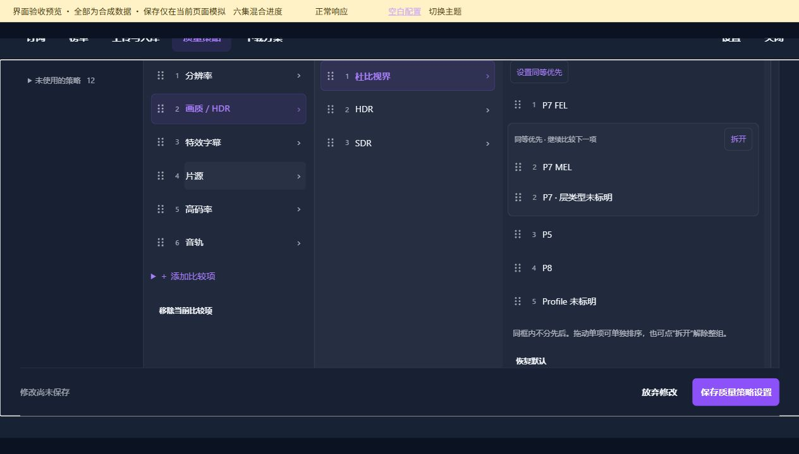

`20-policy-dv-02`

### 第 3 / 4 段

`20-policy-dv-03`

### 第 4 / 4 段

`20-policy-dv-04`

## 设置同等优先：选择 P5 与 P8

### 第 1 / 4 段

`21-equal-select-01`

### 第 2 / 4 段

`21-equal-select-02`

### 第 3 / 4 段

`21-equal-select-03`

### 第 4 / 4 段

`21-equal-select-04`

## 同等优先合并结果与拆开入口

### 第 1 / 4 段

`22-equal-merged-01`

### 第 2 / 4 段

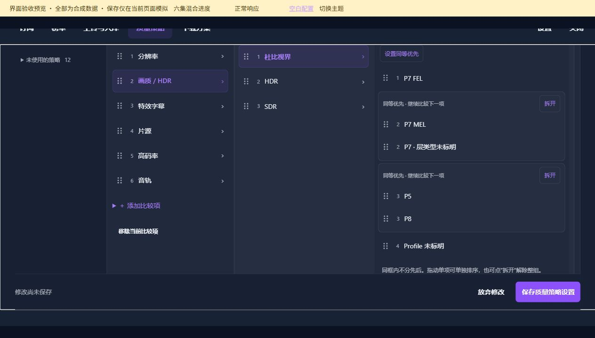

`22-equal-merged-02`

### 第 3 / 4 段

`22-equal-merged-03`

### 第 4 / 4 段

`22-equal-merged-04`

## HDR 格式优先级

### 第 1 / 3 段

`23-hdr-01`

### 第 2 / 3 段

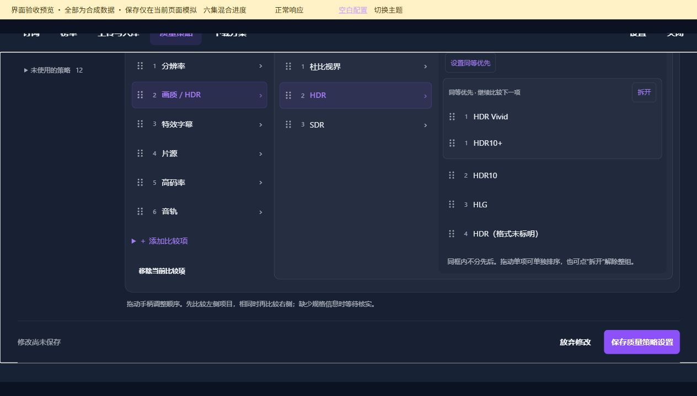

`23-hdr-02`

### 第 3 / 3 段

`23-hdr-03`

## 无损空间音频优先级

### 第 1 / 3 段

`24-audio-lossless-spatial-01`

### 第 2 / 3 段

`24-audio-lossless-spatial-02`

### 第 3 / 3 段

`24-audio-lossless-spatial-03`

## 无损音轨优先级

### 第 1 / 3 段

`25-audio-lossless-01`

### 第 2 / 3 段

`25-audio-lossless-02`

### 第 3 / 3 段

`25-audio-lossless-03`

## 空间音频优先级

### 第 1 / 3 段

`26-audio-spatial-01`

### 第 2 / 3 段

`26-audio-spatial-02`

### 第 3 / 3 段

`26-audio-spatial-03`

## 其他音轨优先级

### 第 1 / 4 段

`27-audio-other-01`

### 第 2 / 4 段

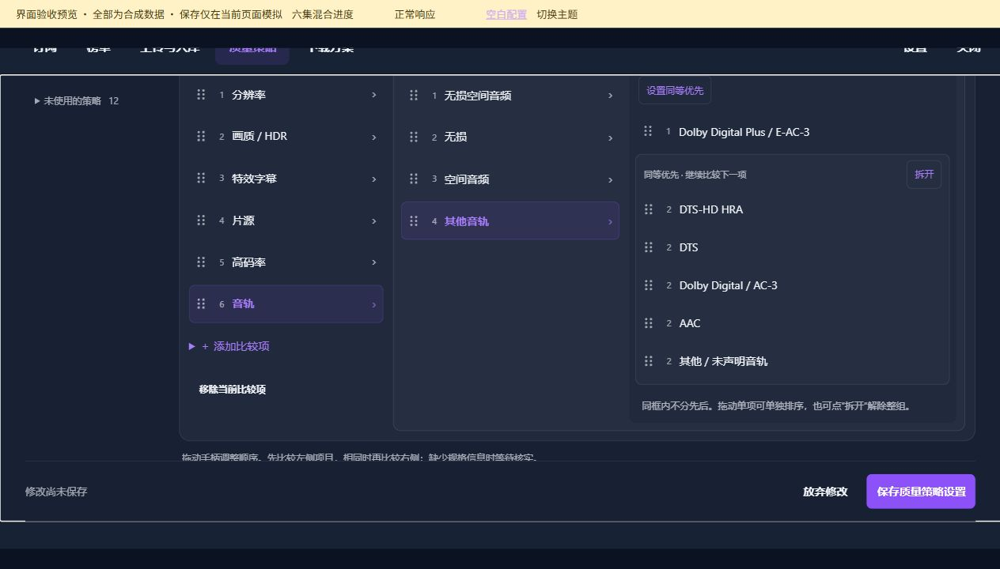

`27-audio-other-02`

### 第 3 / 4 段

`27-audio-other-03`

### 第 4 / 4 段

`27-audio-other-04`

## 分辨率优先级

### 第 1 / 3 段

`28-resolution-01`

### 第 2 / 3 段

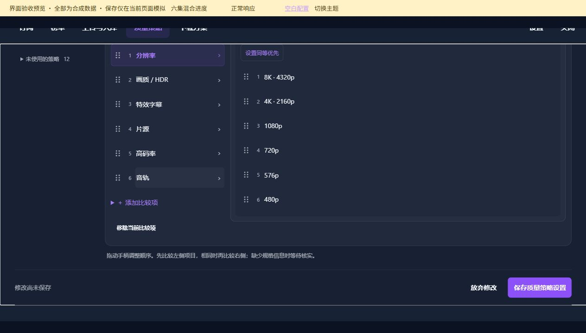

`28-resolution-02`

### 第 3 / 3 段

`28-resolution-03`

## 片源优先级与同等优先分组

### 第 1 / 3 段

`29-source-priority-01`

### 第 2 / 3 段

`29-source-priority-02`

### 第 3 / 3 段

`29-source-priority-03`

## 收录范围：所有规格勾选项完整展开

### 第 1 / 8 段

`30-admission-expanded-01`

### 第 2 / 8 段

`30-admission-expanded-02`

### 第 3 / 8 段

`30-admission-expanded-03`

### 第 4 / 8 段

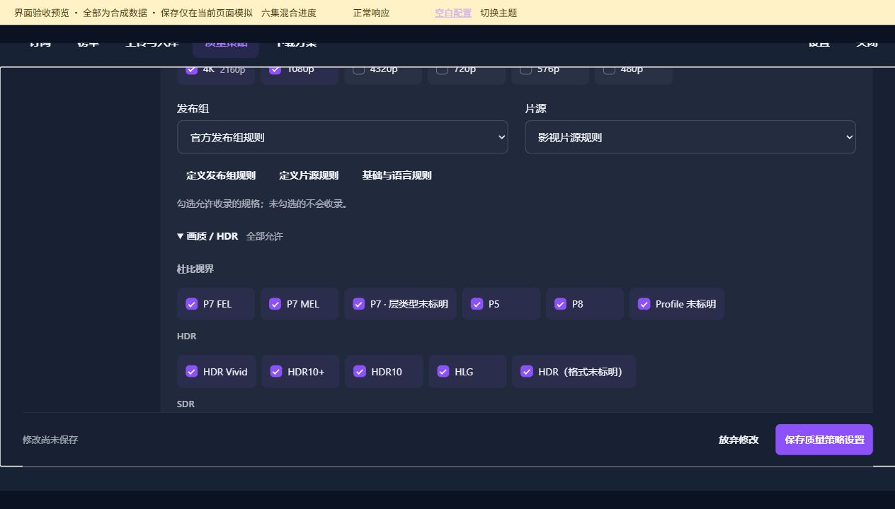

`30-admission-expanded-04`

### 第 5 / 8 段

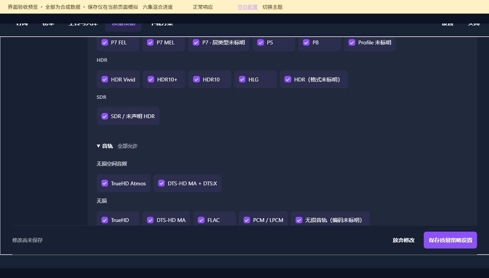

`30-admission-expanded-05`

### 第 6 / 8 段

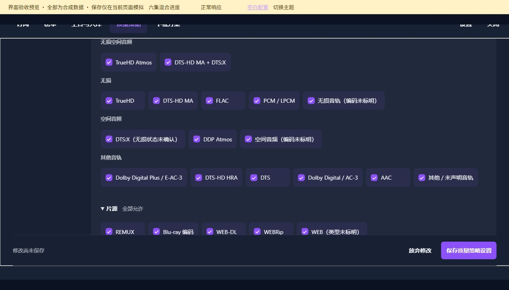

`30-admission-expanded-06`

### 第 7 / 8 段

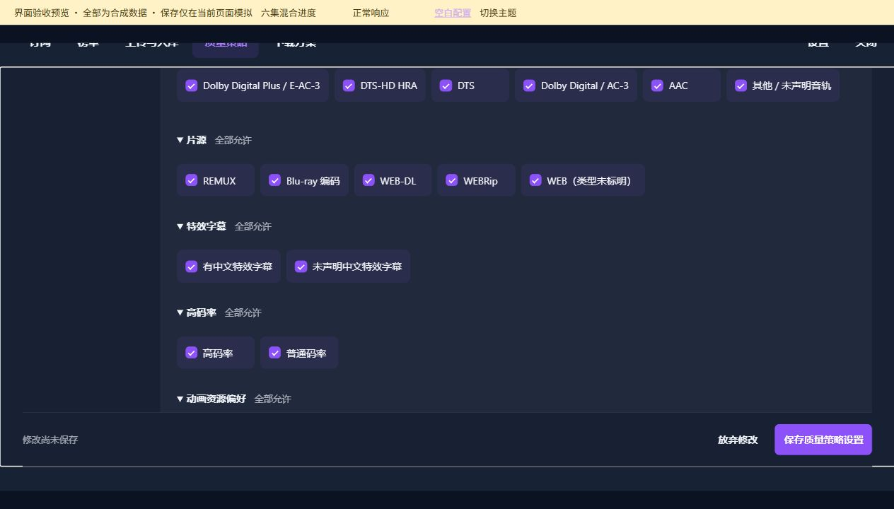

`30-admission-expanded-07`

### 第 8 / 8 段

`30-admission-expanded-08`

## 分类额外条件 · 嵌套与摘要

### 第 1 / 6 段

`31-local-conditions-01`

### 第 2 / 6 段

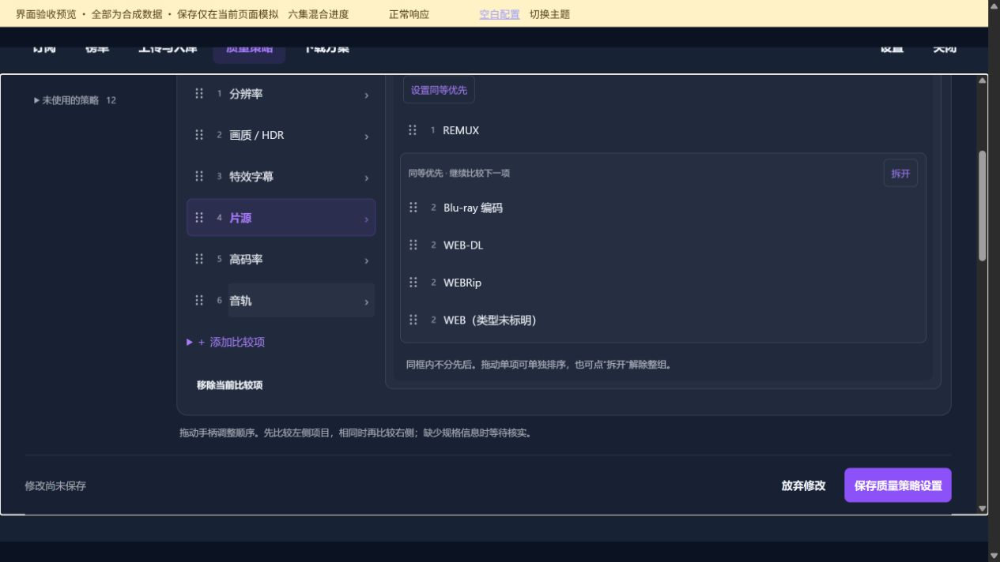

`31-local-conditions-02`

### 第 3 / 6 段

`31-local-conditions-03`

### 第 4 / 6 段

`31-local-conditions-04`

### 第 5 / 6 段

`31-local-conditions-05`

### 第 6 / 6 段

`31-local-conditions-06`

## 质量策略 · 手动试算

### 第 1 / 3 段

`32-policy-trial-form-01`

### 第 2 / 3 段

`32-policy-trial-form-02`

### 第 3 / 3 段

`32-policy-trial-form-03`

## 质量策略 · 合成试算结果

### 第 1 / 3 段

`33-policy-trial-result-01`

### 第 2 / 3 段

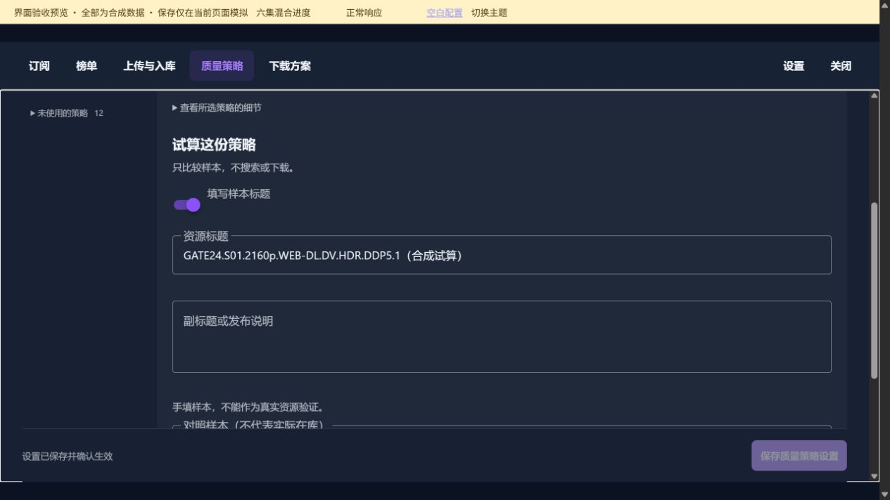

`33-policy-trial-result-02`

### 第 3 / 3 段

`33-policy-trial-result-03`

## 质量策略 · 使用范围

### 第 1 / 2 段

`34-policy-scope-01`

### 第 2 / 2 段

`34-policy-scope-02`

## 全局限制 · 固定收录规格

### 第 1 / 3 段

`35-global-limits-01`

### 第 2 / 3 段

`35-global-limits-02`

### 第 3 / 3 段

`35-global-limits-03`

## 特效字幕优先级

### 第 1 / 3 段

`90-special-subtitles-01`

### 第 2 / 3 段

`90-special-subtitles-02`

### 第 3 / 3 段

`90-special-subtitles-03`

## 高码率优先级

### 第 1 / 3 段

`91-high-bitrate-01`

### 第 2 / 3 段

`91-high-bitrate-02`

### 第 3 / 3 段

`91-high-bitrate-03`

## 添加比较项入口

`92-add-comparison`

## 动画资源偏好优先级

### 第 1 / 3 段

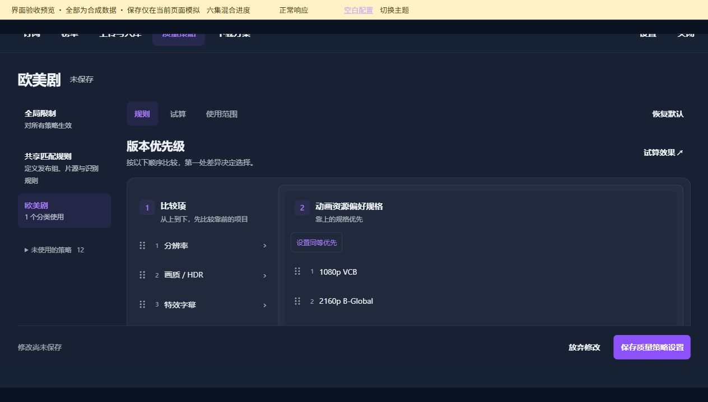

`93-animation-priority-01`

### 第 2 / 3 段

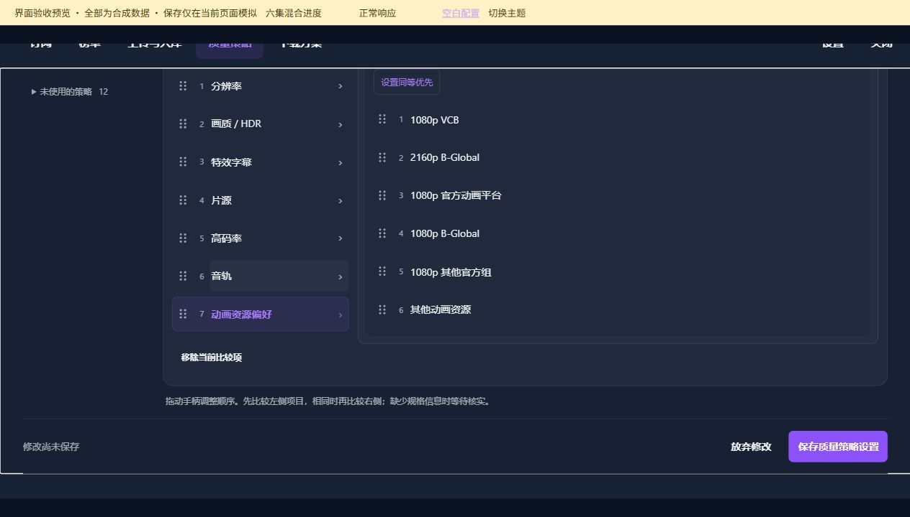

`93-animation-priority-02`

### 第 3 / 3 段

`93-animation-priority-03`
