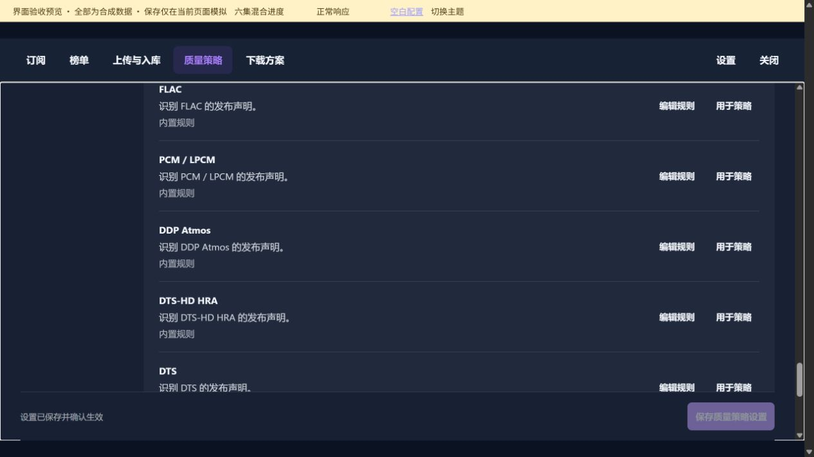
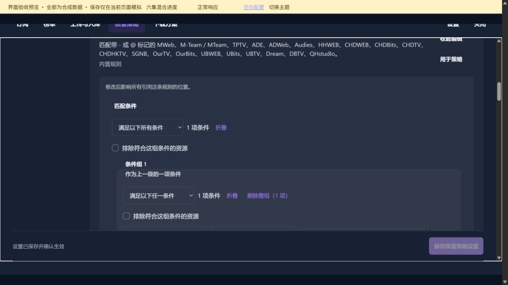

# 共享匹配规则

[返回总目录](README.md)

长页面按分段顺序查看；点击图片可打开原图。

## 本图册目录

- [共享规则完整目录](#36-shared-rules)（17 张）
- [发布组规则 · 条目下就地编辑](#37-rule-inline)（1 张）
- [发布组条件编辑器 · 下半部分](#38-rule-inline-detail)（1 张）
- [共享规则 · 选择应用位置](#39-rule-usage)（1 张）
- [新建共享规则 · 填写匹配条件](#40-custom-rule)（1 张）
- [共享规则已加入策略收录条件](#41-custom-rule-used)（1 张）

## 共享规则完整目录

### 第 1 / 17 段

`36-shared-rules-01`

### 第 2 / 17 段

`36-shared-rules-02`

### 第 3 / 17 段

`36-shared-rules-03`

### 第 4 / 17 段

`36-shared-rules-04`

### 第 5 / 17 段

`36-shared-rules-05`

### 第 6 / 17 段

`36-shared-rules-06`

### 第 7 / 17 段

`36-shared-rules-07`

### 第 8 / 17 段

`36-shared-rules-08`

### 第 9 / 17 段

`36-shared-rules-09`

### 第 10 / 17 段

`36-shared-rules-10`

### 第 11 / 17 段

`36-shared-rules-11`

### 第 12 / 17 段

`36-shared-rules-12`

### 第 13 / 17 段

`36-shared-rules-13`

### 第 14 / 17 段

`36-shared-rules-14`

### 第 15 / 17 段

`36-shared-rules-15`

### 第 16 / 17 段

`36-shared-rules-16`

### 第 17 / 17 段

`36-shared-rules-17`

## 发布组规则 · 条目下就地编辑

`37-rule-inline`

## 发布组条件编辑器 · 下半部分

`38-rule-inline-detail`

## 共享规则 · 选择应用位置

`39-rule-usage`

## 新建共享规则 · 填写匹配条件

`40-custom-rule`

## 共享规则已加入策略收录条件

`41-custom-rule-used`
