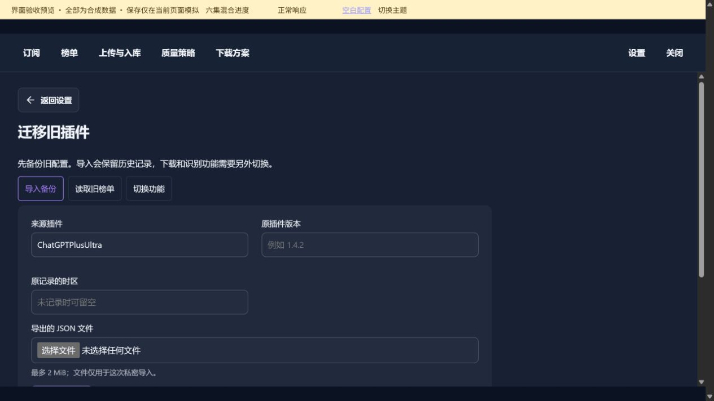
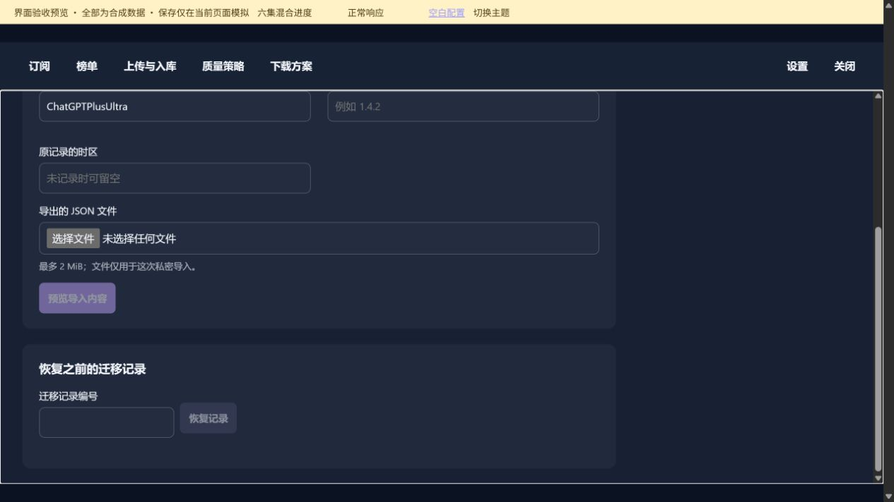
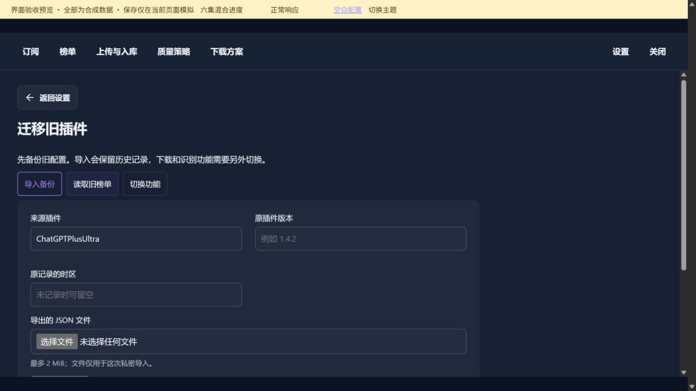
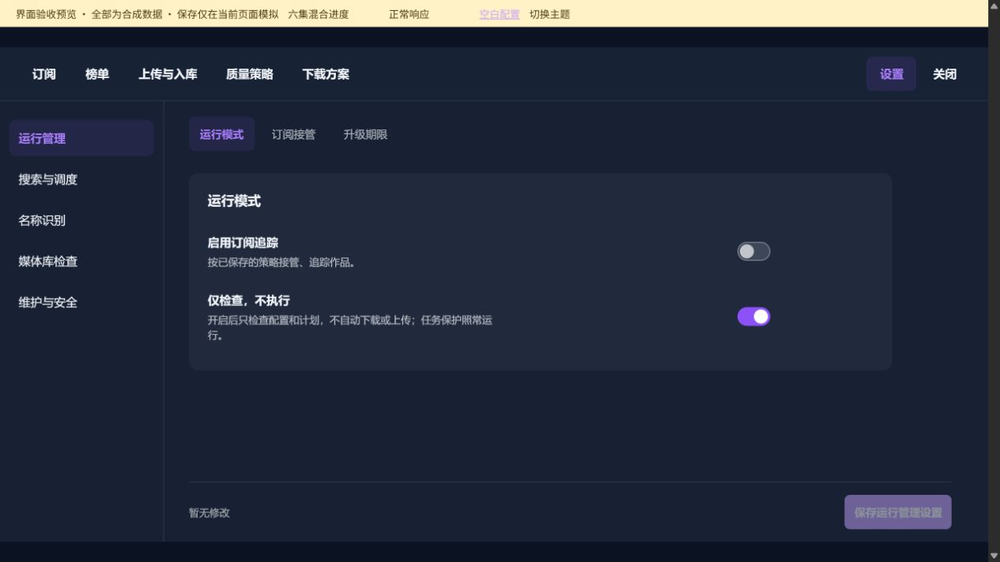

# 初始化与迁移

[返回总目录](README.md)

长页面按分段顺序查看；点击图片可打开原图。

## 本图册目录

- [导入与迁移](#68-migration)（2 张）
- [迁移 · 读取旧榜单](#69-migration-boards)（2 张）
- [迁移 · 切换功能](#70-migration-switch)（3 张）
- [空白配置 · 默认运行模式](#71-blank-configuration)（1 张）
- [空白配置 · 尚无下载方案](#72-blank-plans)（1 张）
- [首次配置 · 新建方案表单](#73-first-plan)（2 张）
- [首次配置 · 下载](#74-first-download)（2 张）
- [首次配置 · 必填项校验提示](#74-first-validation)（1 张）
- [首次配置 · 上传与整理](#75-first-upload)（4 张）
- [首次配置 · 媒体库与路径](#76-first-paths)（4 张）
- [首次配置 · 清理与保留](#77-first-finish)（3 张）
- [首次配置 · 方案保存后的下一步](#79-first-saved)（1 张）

## 导入与迁移

### 第 1 / 2 段

`68-migration-01`

### 第 2 / 2 段

`68-migration-02`

## 迁移 · 读取旧榜单

### 第 1 / 2 段

`69-migration-boards-01`

### 第 2 / 2 段

`69-migration-boards-02`

## 迁移 · 切换功能

### 第 1 / 3 段

`70-migration-switch-01`

### 第 2 / 3 段

`70-migration-switch-02`

### 第 3 / 3 段

`70-migration-switch-03`

## 空白配置 · 默认运行模式

`71-blank-configuration-01`

## 空白配置 · 尚无下载方案

`72-blank-plans-01`

## 首次配置 · 新建方案表单

### 第 1 / 2 段

`73-first-plan-01`

### 第 2 / 2 段

`73-first-plan-02`

## 首次配置 · 下载

### 第 1 / 2 段

`74-first-download-01`

### 第 2 / 2 段

`74-first-download-02`

## 首次配置 · 必填项校验提示

`74-first-validation`

## 首次配置 · 上传与整理

### 第 1 / 4 段

`75-first-upload-01`

### 第 2 / 4 段

`75-first-upload-02`

### 第 3 / 4 段

`75-first-upload-03`

### 第 4 / 4 段

`75-first-upload-04`

## 首次配置 · 媒体库与路径

### 第 1 / 4 段

`76-first-paths-01`

### 第 2 / 4 段

`76-first-paths-02`

### 第 3 / 4 段

`76-first-paths-03`

### 第 4 / 4 段

`76-first-paths-04`

## 首次配置 · 清理与保留

### 第 1 / 3 段

`77-first-finish-01`

### 第 2 / 3 段

`77-first-finish-02`

### 第 3 / 3 段

`77-first-finish-03`

## 首次配置 · 方案保存后的下一步

`79-first-saved`
