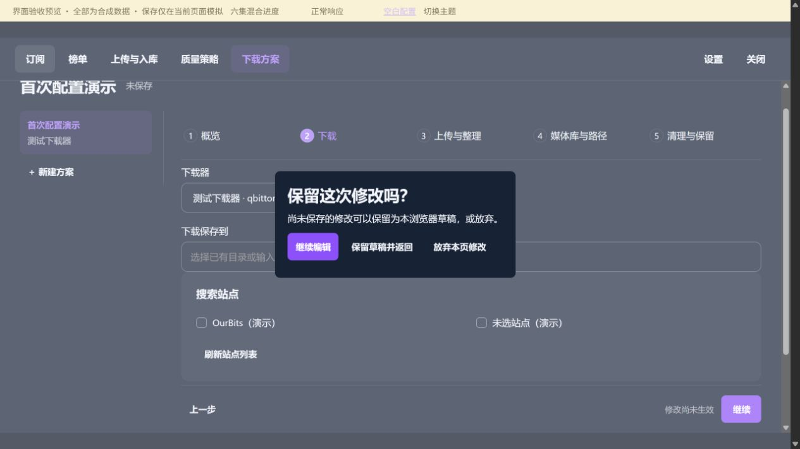
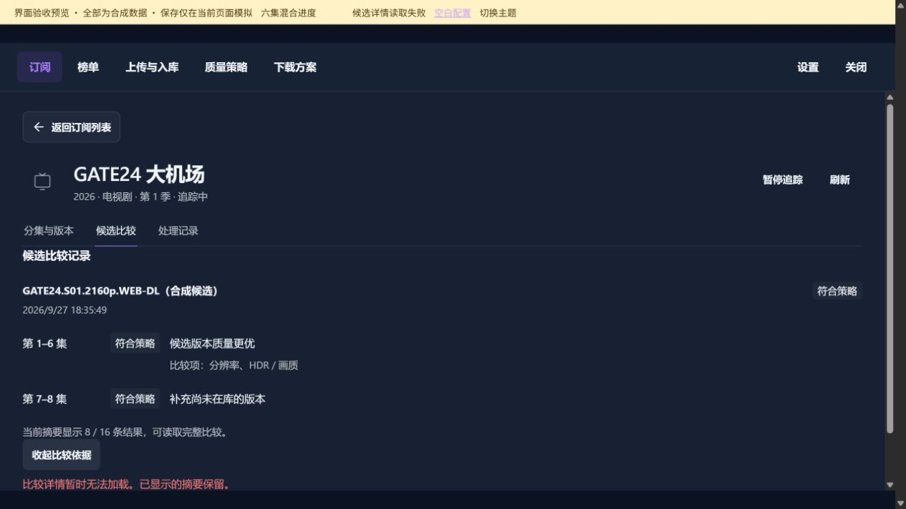
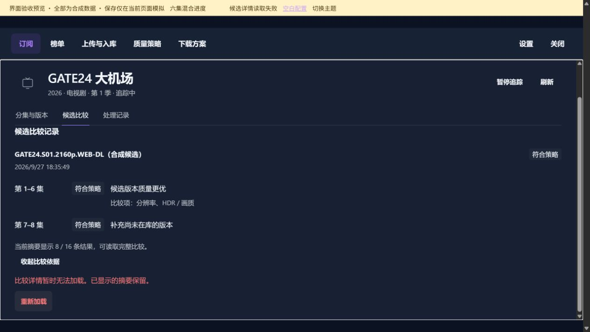

# 异常与提示

[返回总目录](README.md)

长页面按分段顺序查看；点击图片可打开原图。

## 本图册目录

- [离开未保存配置的确认对话框](#78-unsaved-dialog)（1 张）
- [候选比较依据读取失败提示](#80-candidate-error)（2 张）

## 离开未保存配置的确认对话框

`78-unsaved-dialog`

## 候选比较依据读取失败提示

### 第 1 / 2 段

`80-candidate-error-01`

### 第 2 / 2 段

`80-candidate-error-02`
