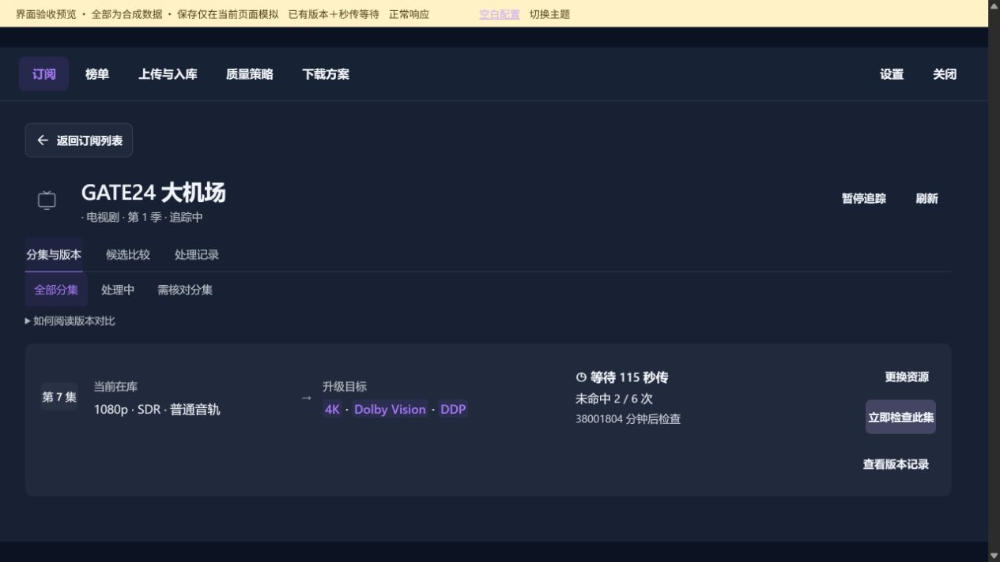
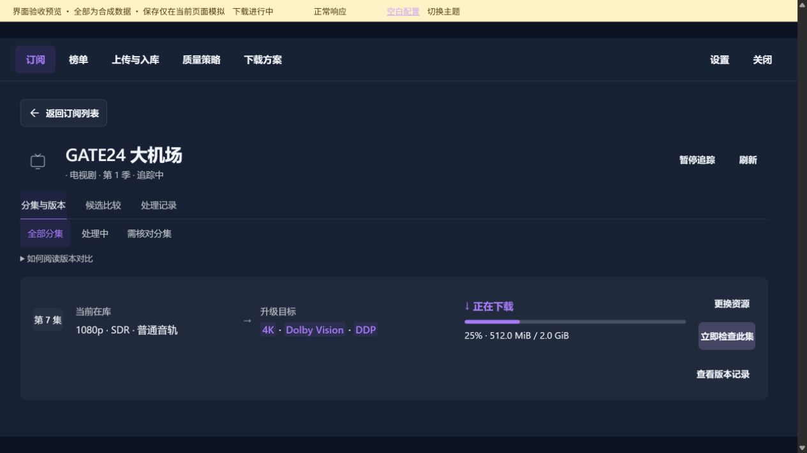
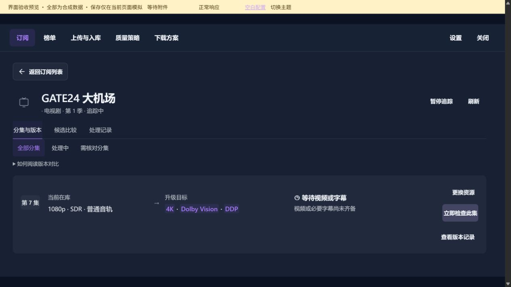
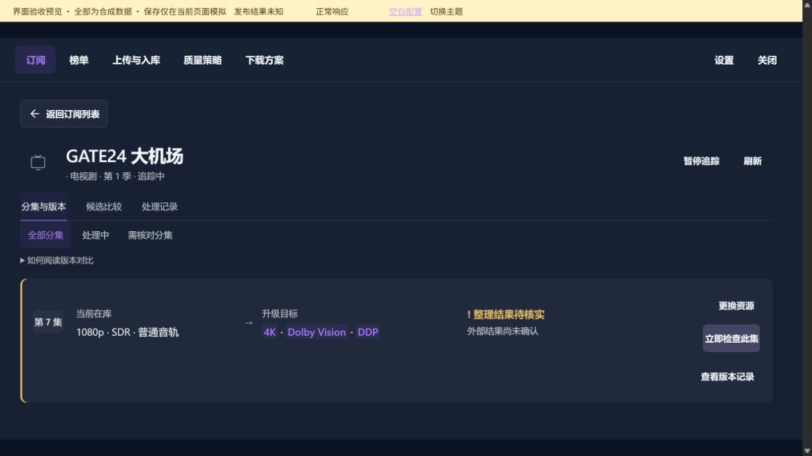
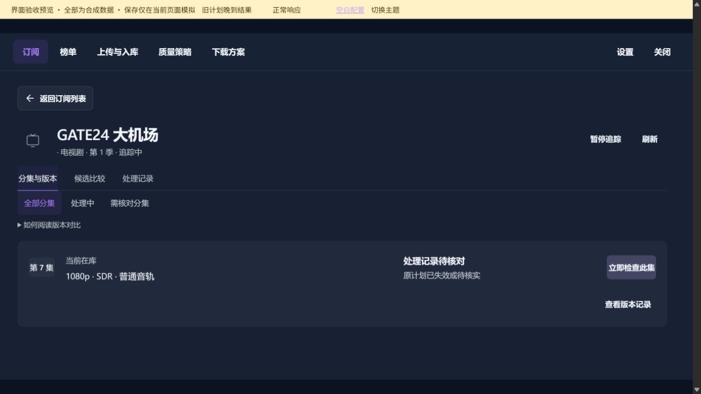

# 处理状态

[返回总目录](README.md)

长页面按分段顺序查看；点击图片可打开原图。

## 本图册目录

- [分集处理状态 · 已有版本＋秒传等待](#81-scene-rapid)（1 张）
- [分集处理状态 · 下载进行中](#82-scene-downloading)（1 张）
- [分集处理状态 · 等待附件](#83-scene-assets)（1 张）
- [分集处理状态 · 发布结果未知](#84-scene-unknown)（1 张）
- [分集处理状态 · 旧计划晚到结果](#85-scene-superseded)（1 张）

## 分集处理状态 · 已有版本＋秒传等待

`81-scene-rapid-01`

## 分集处理状态 · 下载进行中

`82-scene-downloading-01`

## 分集处理状态 · 等待附件

`83-scene-assets-01`

## 分集处理状态 · 发布结果未知

`84-scene-unknown-01`

## 分集处理状态 · 旧计划晚到结果

`85-scene-superseded-01`
