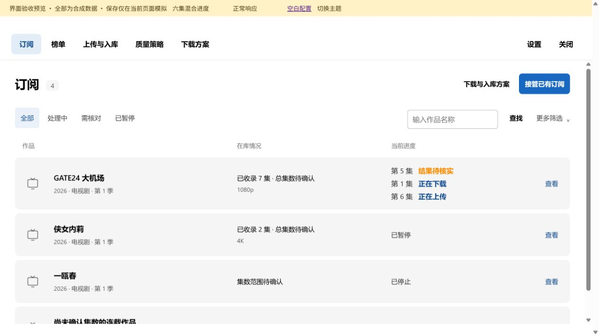
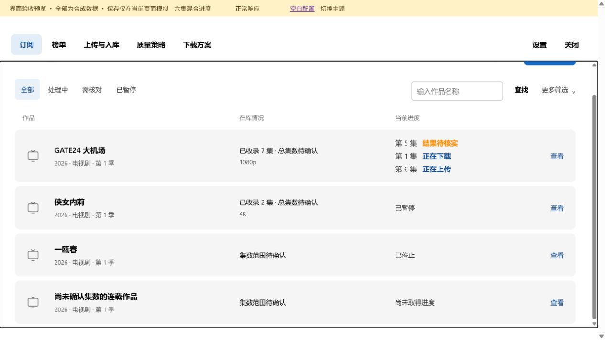
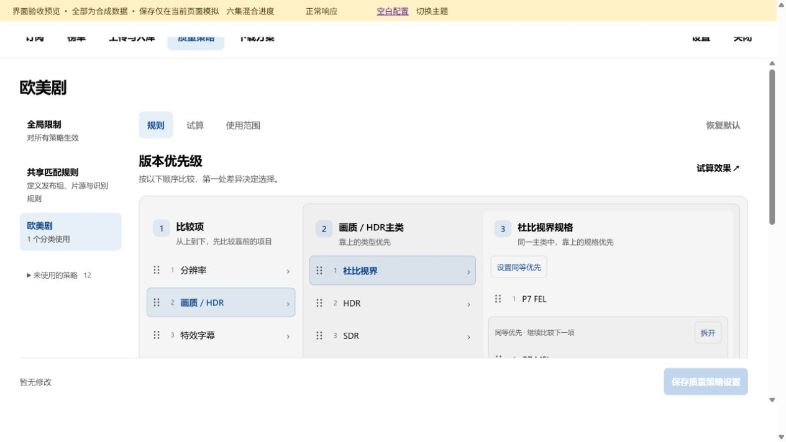
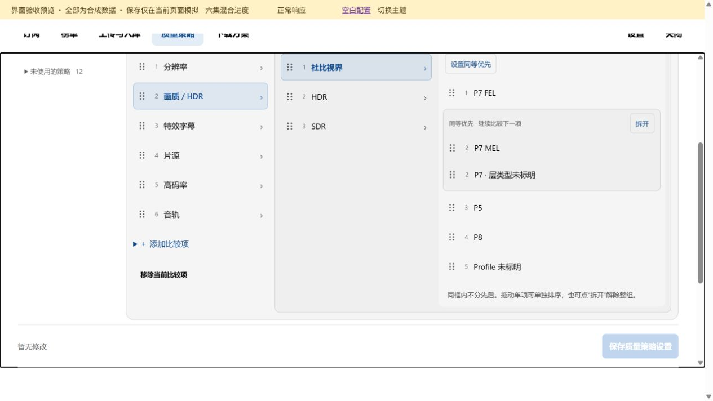
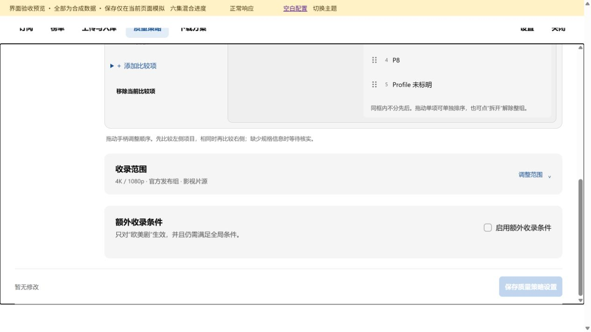
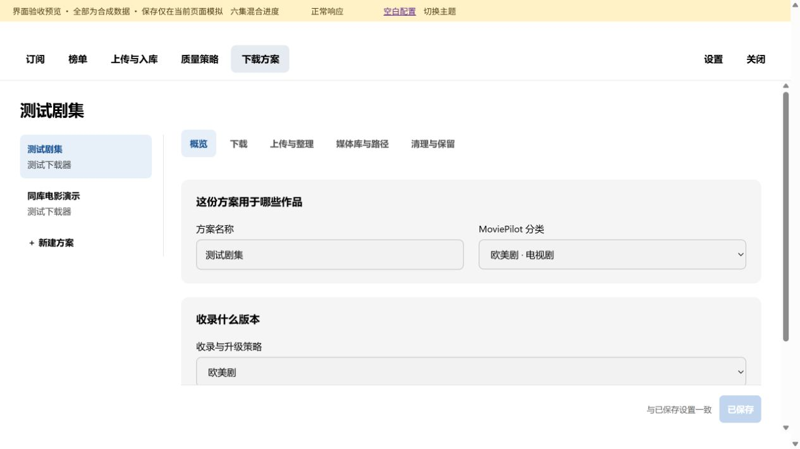
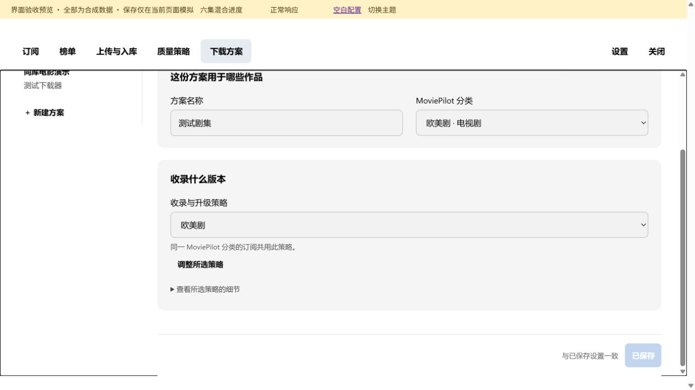
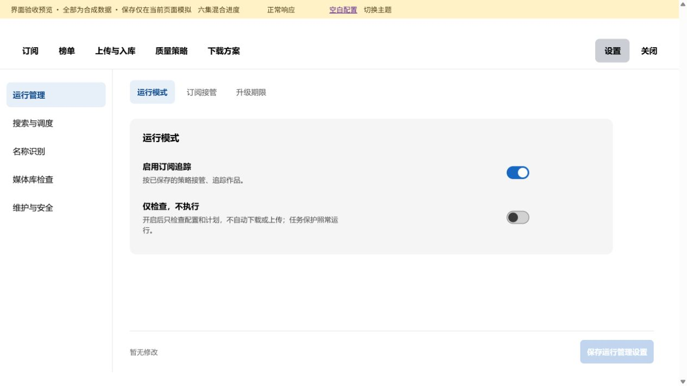

# 浅色主题

[返回总目录](README.md)

长页面按分段顺序查看；点击图片可打开原图。

## 本图册目录

- [浅色主题 · 订阅列表](#86-light-subscriptions)（2 张）
- [浅色主题 · 质量策略](#87-light-policy)（3 张）
- [浅色主题 · 下载方案](#88-light-plan)（2 张）
- [浅色主题 · 设置](#89-light-settings)（1 张）

## 浅色主题 · 订阅列表

### 第 1 / 2 段

`86-light-subscriptions-01`

### 第 2 / 2 段

`86-light-subscriptions-02`

## 浅色主题 · 质量策略

### 第 1 / 3 段

`87-light-policy-01`

### 第 2 / 3 段

`87-light-policy-02`

### 第 3 / 3 段

`87-light-policy-03`

## 浅色主题 · 下载方案

### 第 1 / 2 段

`88-light-plan-01`

### 第 2 / 2 段

`88-light-plan-02`

## 浅色主题 · 设置

`89-light-settings-01`
