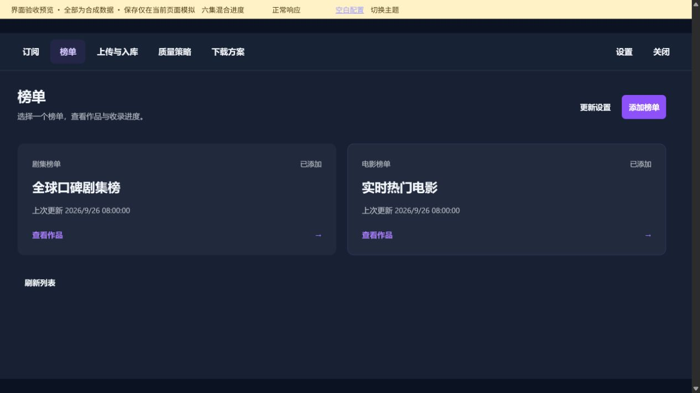

# subscriBetter 前端界面截图 · 2026-10-01

**219 张截图 · 93 个页面或交互状态 · 11 个模块图册**

覆盖主页面、详情、各设置标签、展开编辑、同等优先合并、共享规则使用、首次配置、迁移、异常提示和浅色主题。长页面从顶部连续拍到底部，按顺序查看即可；相邻分段保留重叠内容。

图片来自实际 Vue 前端与本地合成数据预览。黄色顶栏标明合成数据，保存操作仅在预览页模拟。这份图册用于检查界面，不能替代生产服务验收。

## 按模块查看

| 图册 | 页面 / 状态数 | 截图数 |
| --- | ---: | ---: |
| [订阅](01-gallery.md) | 8 | 22 |
| [榜单](02-gallery.md) | 7 | 13 |
| [上传与入库](03-gallery.md) | 3 | 4 |
| [质量策略](04-gallery.md) | 20 | 69 |
| [共享匹配规则](05-gallery.md) | 6 | 22 |
| [下载方案](06-gallery.md) | 6 | 17 |
| [设置](07-gallery.md) | 20 | 30 |
| [初始化与迁移](08-gallery.md) | 12 | 26 |
| [异常与提示](09-gallery.md) | 2 | 3 |
| [处理状态](10-gallery.md) | 5 | 5 |
| [浅色主题](11-gallery.md) | 4 | 8 |

## 重点操作

- [同等优先：选择规格](04-gallery.md#21-equal-select) → [合并结果与拆开入口](04-gallery.md#22-equal-merged)
- [全部收录选项](04-gallery.md#30-admission-expanded) · [分类额外条件](04-gallery.md#31-local-conditions)
- [共享规则就地编辑](05-gallery.md#37-rule-inline) → [应用位置](05-gallery.md#39-rule-usage) → [加入策略](05-gallery.md#41-custom-rule-used)
- [首次配置完整流程](08-gallery.md#73-first-plan) · [未保存提示](09-gallery.md#78-unsaved-dialog)

## 主要页面预览

### [订阅：查看完整图册](01-gallery.md)

### [榜单：查看完整图册](02-gallery.md)

### [上传与入库：查看完整图册](03-gallery.md)

### [质量策略：查看完整图册](04-gallery.md)

### [下载方案：查看完整图册](06-gallery.md)

### [设置：查看完整图册](07-gallery.md)

## 环境与复核

桌面浏览器默认视口 1280 × 720。图片保留截图接口返回的原始尺寸（详见清单），未拼接、重绘或修改界面样式。滚动长页面时保留页头、保存栏及焦点样式。

源代码基准：`2fb389ee9c3e15b1cd4ca962ce85b4ce2a3a2bbd`。本次只补充版本记录的合成预览响应，生产界面代码未修改。

[覆盖范围与限制](COVERAGE.md) · [截图清单、尺寸、哈希与滚动位置](manifest.json)

重新校验并生成目录：`python build_gallery.py`。脚本只整理已拍摄的文件，不生成图片。
